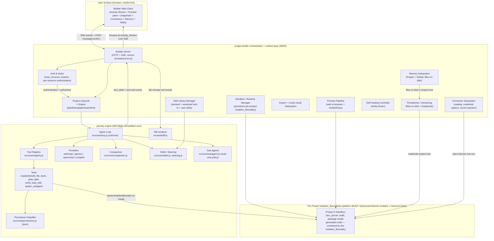

# Design Document: ai-app-builder

## Overview

`ai-app-builder` is a greenfield platform (the class of Bolt, Replit, Lovable, v0, Rork) in which a user
describes an application in natural language and receives a working, running, iteratively-refinable
project. This design specifies **how it is built on top of the existing `plumby` coding agent**
(`/projects/sandbox/plumby`) rather than reinventing a code-generation engine.

The central architectural stance is a clean split:

- **Plumby is the engine.** Plumby already provides the agent loop (`src/core/loop.js`), a tool registry
  (`read_file`, `write_file`, `edit_file`, `bash`, `grep`, `glob`, `verify`, `load_skill`,
  `spawn_subagent` — `src/tools/`), three providers behind one neutral message format
  (`src/providers/anthropic.js`, `gemini.js`, `openrouter.js`, plus `scripted.js` as the test seam),
  streaming as `text_delta` events, context compaction (`src/core/compaction.js`), steering + skills with
  progressive disclosure (`src/core/steering.js`, `src/core/skills.js`, `src/tools/load_skill.js`),
  fresh-context sub-agents (`src/core/subagent.js`), a **pure** permission classifier
  (`src/core/permissions.js`: `allow | confirm | refuse`), and a web surface that streams loop events over
  SSE and renders visual diffs (`src/web/server.js`, `src/web/events.js`, `src/web/diff.js`).
- **ai-app-builder is a new orchestration + surface layer around that engine.** Almost everything unique
  to a "build me an app" product — authentication/authorization, project lifecycle, per-project sandboxes,
  live preview, persistence/snapshots, connectors, project origins, export + lock-in audit, memory, the
  skill library — lives in this new layer and **consumes plumby's seams** rather than modifying plumby's
  core. The single discipline that makes this possible is the one plumby already enforces: *"The core
  imports nothing terminal-specific. The loop emits events; a surface decides how to draw them."* (README,
  "Layout"). The builder is a second surface, exactly as `src/web/` was a second surface next to the CLI.

Two concerns are called out up front because they are the largest net-new build items and are **not**
inherited from plumby:

- **Per-project isolation is BUILT by the platform, not inherited.** Plumby's own README is explicit that
  its permission model is *"a permission model, not a sandbox."* Plumby's `classifyCommand` only gates
  **whether** a command runs (`allow | confirm | refuse`); it does not contain **what** a command does once
  it is running, and plumby ships **no per-project multi-tenant isolation**. Real per-Project isolation — a
  platform-provisioned `Isolation_Boundary` with filesystem, process, and network isolation plus resource
  limits (CPU, memory, execution-time), enforced **independently of the classifier** so it holds even for
  `allow` commands — is a component the platform must build. It is the single largest scope item in this
  design. Plumby contributes only its pure classifier and its opt-in whole-agent `Dockerfile` as a
  *starting point*, not the boundary itself.
- **Authentication and authorization are new.** A `User_Account` owns Projects, User_Skills, Global_Memory,
  Connectors, and Secrets; authentication is required before create/open/modify, and every resource action
  is authorization-checked against the requesting `User_Account`. Plumby has no notion of accounts, so this
  subsystem is built fresh in the builder layer (see [Authentication & Authorization](#0-authentication--authorization)).

Where the builder **extends plumby's core** rather than merely consuming it, this design says so
explicitly (see [Where We Reuse vs. Extend Plumby](#where-we-reuse-vs-extend-plumby)). The bias is heavily
toward reuse.

### Product scope recap

Four Target_Categories, all in scope: `web` (React/Next-style, in-browser preview), `full-stack-web`
(frontend + backend + database), `mobile` (React Native / Expo), and `multi-target` (web + mobile +
backend + shared). A first-class product principle is **portability / no lock-in**: generated projects
carry no platform telemetry, no injected branding, and no enforcement rules that break a build when
platform code is removed, and a user can export and continue anywhere.

### How it sits on top of plumby (component diagram)



The essential reading: **the Builder Server is a consumer of plumby's `onEvent`**, exactly as
`src/web/server.js` is. Every request first passes Auth & Authz (authenticated `User_Account`, per-resource
authorization). Every generation turn is a plumby loop turn scoped to one Project (a `Builder_Agent`).
File-changing tool events flow through plumby's existing diff renderer. Every command runs inside that
Project's platform-built `Isolation_Boundary` — which contains what the command can reach — **and**
independently passes plumby's pure permission classifier, which gates whether the command runs at all. The
two are separate mechanisms: the classifier decides *whether*, the Isolation_Boundary contains *what*.

### Where we reuse vs. extend plumby

| Concern | Reuse plumby as-is | Extend plumby core | New in builder layer |
|---|---|---|---|
| Auth & authorization | — (plumby has no accounts) | — | **Entirely new**: User_Account, sessions, per-resource authorization |
| Generation loop | `src/core/loop.js` (`runTurn`, `onEvent`) | — | Per-project agent orchestration |
| Streaming reasoning | `text_delta` events | — | Forward to Activity_Stream (SSE) |
| Tools | all 9 tools unchanged | — | Route their execution into a container |
| Diffs | `src/web/diff.js` | — | Render inline in Activity_Stream |
| Permission gating | `src/core/permissions.js` (pure) | Add a container-boundary rule to the surface's guard, **not** to `classifyCommand` | Confirm UI, 60s consent timeout, fail-closed |
| Providers / model select | provider abstraction + env resolution | — | Per-session provider/model selection UI |
| Skills | `skills.js`, `load_skill` progressive disclosure | — | Skill Library CRUD + build/release-time vendoring copy step |
| Sub-agents | `subagent.js` read-only policy | — | Delegate audits/investigations |
| Compaction | `compaction.js` discipline | — | Reused as the model for Memory eviction |
| Verify / self-heal | `verify` tool | — | Self-Healing controller loop |
| Persistence | "files on disk beat context" philosophy | — | Snapshots, atomic commit, resume |
| Sandbox / per-project isolation | Classifier (`allow/confirm/refuse`) + opt-in whole-agent `Dockerfile` **as a starting point only** | — | **The Isolation_Boundary itself** — platform-built per-project fs/process/network isolation + resource limits, enforced independently of the classifier (the largest build item) |

The only place the design touches plumby's core execution is at the **surface guard** that wraps command
execution: the builder composes a boundary check *around* `classifyCommand` (which stays pure and
unchanged), so the two safety layers — "is this command destructive?" (plumby's classifier, which only
gates *whether* a command runs) and "is this command contained within this Project's Isolation_Boundary?"
(the platform-built boundary, which contains *what* a running command can reach) — are separable and
independently testable. Because plumby provides no isolation of its own, the Isolation_Boundary is a genuine
new build, not a wrapper over an existing plumby capability.

---

## Architecture

This section walks each subsystem, naming the concrete plumby seam it reuses and the requirements it
satisfies.

### 0. Authentication & Authorization

**Responsibility:** establish an authenticated `User_Account` and make every resource action
authorization-checked. This subsystem is **entirely new** — plumby has no concept of accounts, sessions, or
ownership — so nothing here is reused from plumby's core; it is built as a gate in the builder surface layer
that runs *before* any request reaches the Project lifecycle or the plumby loop.

- **Authentication required before create/open/modify (Req 7.1–7.2).** No `User_Account`, no access: an
  unauthenticated request to create, open, or modify a Project is denied and the Project's contents are not
  disclosed (Req 7.2).
- **Ownership model (Req 7.3).** Every `Project`, `User_Skill`, `Global_Memory` store, `Connector`, and
  `Secret` is associated with an owning `User_Account`. Ownership is recorded on the control-plane record
  (see the `ownerId` field on the data models) and is the anchor for all authorization decisions.
- **Per-resource authorization (Req 7.4).** Every action on a resource is checked: when a `User_Account`
  attempts an action on a resource it does not own and has not been granted access to, the platform denies
  the action via `Authorization` and returns an access-denied indication.
- **"Authorized to access" resolves against the requester (Req 7.5).** Wherever another requirement speaks
  of a user being "authorized to access" a repository (`github-import`, Req 6.4), a Project (`fork`, Req
  6.6–6.7), or a `Share_Link` (Req 23), that authorization is determined against the **requesting
  `User_Account`**. This subsection is the single place that decision lives, and the origins/sharing
  subsystems delegate to it.
- **Scoping (Req 7.6).** On authentication, Builder_Agent sessions, Projects, and memory (Project_Memory and
  Global_Memory) are scoped to that `User_Account`, so one user never sees another user's sessions, projects,
  or memory.

**Satisfies:** Req 7.

### 1. Orchestration / surface layer (Builder Server)

**Responsibility:** own the Project lifecycle, translate user actions (create, refine, preview, snapshot,
connect, export, audit) into plumby loop turns, and stream results back to the browser.

**Reuses:** `createAgent` + `onEvent` exactly as `bin/plumby-web.js` + `src/web/server.js` do. The Builder
Server binds an HTTP server, opens one SSE stream per Session (`GET /events`), accepts a user message over
`POST /message` (acknowledged 202, streamed over SSE — mirroring `src/web/server.js`), and takes
confirm-class approve/deny over `POST /confirm`. A `Builder_Agent` is a `createAgent` instance whose
working directory is a single Project's tree inside that Project's Sandbox (Req 2.1 — changes apply only
to files in that Project).

**One turn at a time per Project.** Plumby's web surface already runs one turn per process; the builder
generalizes this to one in-flight turn *per Project Session* with the same `turn_start` / `turn_state`
reconnection frames described in the README so a dropped phone connection resumes cleanly.

**Satisfies:** Req 1 (creation orchestration), Req 2 (refinement routing), Req 21 (provider/model
selection wiring). Every request is gated by Auth & Authz (Req 7) before it reaches the loop.

### 2. Project lifecycle + Project Origins subsystem

**Responsibility:** create a Project from one of four `Project_Origin`s and then converge all four onto the
identical downstream pipeline (Req 6.8).

- **`blank`** — write only the minimal files for the Sandbox + Dev_Server to start (Req 6.2, Property 11).
- **`template`** — copy the `Template` matching the `Target_Category` (Req 5, Req 6.3).
- **`github-import`** — clone the repository into the Project's Sandbox within 120s (Req 6.4). The glossary
  term is `Repository_Import`; the operation is described consistently as **"clone the repository"** in
  this design (decision (e)). Clone runs as a `bash` command inside the Sandbox and therefore passes the
  permission classifier; on invalid/inaccessible reference or timeout the import aborts, creates no partial
  Project, and leaves **no orphaned Sandbox running** (Req 6.5) — the runtime manager tears the container
  down in a `finally`, mirroring the eval runner's "always removed in a finally" discipline
  (`eval/runner.js`).
- **`fork`** — copy the referenced Project's **most recent Snapshot** as the new starting state, fully
  independent of the origin (Req 6.6, Property 10). Authorization is checked before any files are copied
  (Req 6.7).

Input validation (Req 1.4–1.6, 5.7): description trimmed to 1–5,000 chars; `Target_Category` and
`Project_Origin` validated against their closed enums *before* any Project is created.

**Creation timing (Req 1.1).** The 10-second bound is a **"begins creation"** bound, not a
"finished project" bound: within 10 seconds the platform **records the Project and allocates its Sandbox so
the Project becomes available for streaming** — the control-plane record + Isolation_Boundary allocation.
**Origin population then completes within origin-specific bounds measured separately**: Template population
within 30 seconds (Req 5.2) and `github-import` clone within 120 seconds (Req 6.4). Full source generation
streams afterward and is not bounded by the 10-second window. The design never claims a complete project is
produced in 10 seconds.

### 3. Per-project Sandbox / runtime manager (the platform-built Isolation_Boundary)

**Responsibility:** provision every Project a **platform-built `Isolation_Boundary`** — a container or
virtual machine with **filesystem, process, and network isolation plus resource limits** (at minimum CPU,
memory, and execution-time) — in which build, Dev_Server, package installation, and all generated-code
execution run, with **no cross-Sandbox access** to another Project or the host (Req 8.1–8.6, Req 22.2). This
is **the single largest build item in the design**: plumby ships no per-Project multi-tenant isolation, so
the boundary is created here, not inherited.

**The Isolation_Boundary is distinct from, and independent of, the classifier (Req 8.5).** Plumby's
`classifyCommand` gates **whether** a command runs (`allow | confirm | refuse`) and does **not** contain
**what** a command does once running — plumby's README calls its model *"a permission model, not a
sandbox."* The Isolation_Boundary is what contains a running command's reach, and the platform **enforces it
independently of the classifier**, so isolation holds even for commands the classifier marks `allow`. A
command that stays classified `allow` still cannot touch another Project's filesystem, processes, or network,
because the boundary — not the classifier — is what confines it.

**Reuses (as a *starting point* only):** plumby contributes its **pure permission classifier**
(`src/core/permissions.js`) and its **opt-in whole-agent `Dockerfile`** (non-root user, keys from env at run
time only — README "Running in a container"). Neither of these is per-Project multi-tenant isolation; they
are inputs the runtime manager builds on. The runtime manager is the builder-layer component that:
provisions an `Isolation_Boundary` per Project (fs/process/network isolation), applies the resource limits
(Req 8.2), mounts only that Project's tree, enforces the boundary independently of the classifier (Req 8.5),
routes every command through the classifier on top of the enforced boundary (Req 8.7), and reaps boundaries
(including orphan cleanup on failed import, Req 6.5). Every command the `Builder_Agent`'s `bash`/`verify`
tools emit is executed *inside* that Project's Isolation_Boundary. A command that attempts to reach another
Project's Sandbox or the host outside the boundary is blocked, the target state is preserved unchanged, and
a denied error is returned (Req 8.6, Req 22.2).

**Command path (two separable gates):**

```mermaid
sequenceDiagram
  participant Agent as Builder_Agent (plumby loop)
  participant Guard as Surface guard (builder)
  participant Perm as classifyCommand (plumby, pure)
  participant Box as Isolation_Boundary (builder-BUILT)
  participant SBX as Project Sandbox (inside boundary)

  Note over Box: Boundary is enforced independently of the classifier (Req 8.5)<br/>and confines every command, even allow-class
  Agent->>Guard: execute command C
  Guard->>Perm: classifyCommand(C)  (≤10s)
  alt no classification within 10s / unavailable
    Perm-->>Guard: (none)
    Guard-->>Agent: FAIL-CLOSED → treat as refuse (Req 8.8, 22.5)
  else refuse
    Perm-->>Guard: refuse
    Guard-->>Agent: blocked, state unchanged (Req 8.9, 22.3, Property 5)
  else confirm
    Perm-->>Guard: confirm
    Guard->>UI: confirm_request (SSE)
    UI-->>Guard: approve within 60s? (Req 8.10, 22.4)
    alt approved
      Guard->>Box: run within boundary
    else denied / timeout
      Guard-->>Agent: denied, state unchanged
    end
  else allow
    Perm-->>Guard: allow
    Guard->>Box: run within boundary (still fully contained)
  end
  Box->>Box: contain C to this Project's Isolation_Boundary
  alt escapes boundary
    Box-->>Agent: denied error, target state unchanged (Req 8.6, 22.2)
  else within boundary
    Box->>SBX: run inside boundary
    SBX-->>Agent: output (truncated at 64 KB/stream + notice, Req 22.7)
  end
```

**Sub-agent policy:** when the `Builder_Agent` delegates via `spawn_subagent`, the sub-agent's commands run
under plumby's **read-only sub-agent policy** — any confirm- or refuse-class command is blocked without
execution (Req 22.6), exactly as `src/core/subagent.js` and the read-only toolset already enforce.

**Satisfies:** Req 8 (Isolation_Boundary provisioning, resource limits, classifier-independent enforcement),
Req 22, Property 1 (Isolation_Boundary confines all commands), Property 5 (refuse never runs).

### 4. Preview pipeline (web in-browser + mobile/Expo)

**Responsibility:** serve a live, interactive Preview of the Project and keep it in step with committed
state.

- **`web`** Target: the Dev_Server inside the Sandbox serves an in-browser Preview reflecting the current
  committed Project state, accepting real input events (Req 3.1).
- **`mobile`** Target: an Expo-compatible Preview endpoint reachable within 60s of Dev_Server start, with a
  scannable **QR code** and a **connection URL** shown to the user (Req 3.2, Req 15.2–15.3).
- **`multi-target`**: a Target selector (`web` / `mobile` / `backend`); default `web` with an explicit
  "default used" indication when none is chosen (Req 16.4–16.5).

**Preview vs. Snapshot timing (decision (d) — reconciling Req 3.1, 3.3 and Property 3).** The Dev_Server
naturally hot-reloads uncommitted edits, but the **served Preview the user is told is "the app"** is
defined against **committed Snapshot state**, and the pipeline enforces this explicitly:

1. During a generation turn, edits stream into the Sandbox working tree; the Dev_Server may hot-reload them
   for the agent's own build/verify, but the Preview surface **labels this as in-progress/building** and
   does not present it as the committed app.
2. A **Snapshot commit** (see §6 and decision (b)) is the event that "publishes" state to the Preview. On
   commit, the pipeline points the served Preview at the committed tree and updates it **within 5 seconds**
   (Req 3.3). This is the only transition at which the Preview is asserted to reflect "current committed
   Project state" (Req 3.1, Property 3).
3. If a committed Snapshot fails to compile/build, the pipeline **retains the last successfully-built
   Preview**, shows the captured build error, and indicates the Preview is showing a **prior** state (Req
   3.4). This is what makes Property 3 hold even when the newest commit is broken: the served content
   always corresponds to the most-recent *successfully-built committed* Snapshot, never to uncommitted
   intermediate state.

Startup/liveness handling: preview-loading status while starting; 60s startup-timeout error with a restart
offer (Req 3.5); unexpected-exit handling that preserves state and offers restart (Req 3.6); restart capped
at **3 attempts** then a persistent-failure error with no further automatic restarts (Req 3.7).

**Satisfies:** Req 3, Req 15, Req 16.4–16.5.

### 5. Activity Stream (SSE, mirroring plumby's web surface)

**Responsibility:** surface the Builder_Agent's reasoning and actions live, concurrently with the Preview.

**Reuses:** this is a near-direct reuse of `src/web/events.js` + `src/web/server.js`. The Activity_Stream
is a consumer of plumby's `onEvent`:

- `text_delta` events → streamed reasoning, forwarded without waiting for turn completion (Req 4.1).
- tool-call events (`read_file`, `write_file`, `edit_file`, `bash`, `grep`, `glob`, `verify`,
  `load_skill`, `spawn_subagent`) → surfaced in occurrence order (Req 4.2).
- file-modifying tool events → rendered inline as a **Diff** via `src/web/diff.js` (Req 4.3, Req 2.3). As
  the README notes, an `edit_file` event carries a focused `old_string → new_string` diff and a
  `write_file` event is a full-content "new file" view; both are labeled as such — the builder inherits
  this labeling verbatim.
- turn completion → an explicit completion indicator (Req 4.5).
- output exceeding plumby's per-stream cap → truncated with a truncation notice (Req 4.6, Req 22.7: first
  64 KB retained + a notice line stating bytes omitted, from `src/core/truncate.js`).

The client presents Activity_Stream and Preview **concurrently** (side-by-side / tabbed on mobile) so the
user watches reasoning and the running app at once (Req 4.4).

**Satisfies:** Req 4.

### 6. Persistence / versioning / Snapshots (files-on-disk)

**Responsibility:** never lose work; make every Project resumable and restorable to any prior committed
state — as **files on disk**, consistent with plumby's "files on disk beat context" philosophy (PLAN §3,
Req 19.9).

**Durable file-state persistence (Req 19.1):** during a Session, the Project tree is the source of truth on
the Sandbox's mounted volume. After a file change becomes **idle** (a short debounce), the builder persists
the tree to durable storage **within 2 seconds**, so it is readable in a later Session. A persistence
failure retains the last good state and returns an error (Req 19.2).

**Snapshots (Req 19.3–19.8):** a Snapshot is a **committed, restorable copy of the full file state**,
recorded **atomically** (fully recorded or not at all) — implemented as a content-addressed commit (a Git
commit in the Project's repository is the natural fit and directly honours Req 19.9's "files on disk in the
Project's repository"). A failed Snapshot discards the partial and retains the most recent complete one
(Req 19.4). Restore is deterministic and **idempotent** (Property 6). Resume rules: reopen → restore most
recent complete Snapshot (Req 19.5); if none, restore most recent persisted file state (Req 19.6).

**Snapshot commit trigger (decision (b) — reconciling Req 18 with preview behavior).** A Snapshot is
committed on **either** of two triggers, and never on every keystroke:

1. **Automatic:** at the end of a generation turn **once `verify` returns `verdict: PASS`** (Req 20.1) — a
   green turn is a publishable unit of work. If the turn ends `FAIL` and self-healing cannot reach PASS
   within its attempt cap, no automatic Snapshot is committed for that turn (the working tree is still
   persisted per Req 19.1 and remains editable, Req 1.7).
2. **Explicit:** an explicit user "save/commit" action, and any operation that semantically requires a
   restore point (e.g., accepting a set of changes).

This reconciles with Req 19.1: **idle persistence (≤2s)** guarantees durability of *in-progress* work
(nothing is lost on a crash), while **Snapshot commit** (turn PASS or explicit action) defines the
*published, restorable, preview-visible* state. The Preview updates within 5s of a Snapshot commit
(decision (d), Req 3.3). The two mechanisms are complementary: persistence is about *not losing bytes*;
Snapshots are about *named restore points and what the Preview shows*.

**Satisfies:** Req 19, Property 4 (`restore(persist(state)) == state`), Property 6 (idempotent restore).

### 7. Connector subsystem (catalog, credential capture, secret injection)

**Responsibility:** first-class managed integrations so a user does not hand-wire credentials.

- **Connector_Catalog** across all six `Connector_Category` values: `database` (Supabase, Neon), `auth`
  (Clerk, Auth0), `payments` (Stripe), `hosting-deploy` (Vercel, Netlify, Expo EAS), `storage`, `ai-model`
  (Req 10.1).
- **Credential capture** — OAuth authorization or API-key entry per Connector (Req 10.2). On success the
  credential is stored as a **Secret** and **injected into the Sandbox environment at runtime** (Req 10.3,
  Req 9.6). On failure/cancel/deny nothing partial is stored and existing Connectors/Secrets are unchanged
  (Req 10.6).
- **Secret injection, never in source** — Secrets are injected as environment configuration into the
  Sandbox; **no generated source file contains a literal credential or Secret value** (Req 9.7, Req 10.4,
  Req 11.4, Properties 8 & 9). If generation would ever write a literal credential or hardcoded platform
  host, it is replaced with an env-var reference and the substitution is **recorded in a report** (Req
  11.5).
- **Agent awareness** — an added Connector is surfaced to the Builder_Agent (via the Project's steering /
  a connectors manifest — see §11 memory/context) so it generates integration code referencing the
  injected Secret, not a literal (Req 10.5).
- **Removal** — revokes the Secret's injection and reports it (Req 10.7).
- **`hosting-deploy`** Connectors act as deploy destinations; any deploy command is routed through the
  permission classifier (Req 10.8, Req 18.4).

**ai-model Connector vs. the builder model (decision (c) — explicit boundary).** These are two unrelated
concerns and the design keeps them apart:

- **The model that BUILDS the app** is a plumby *provider/model* (anthropic | gemini | openrouter),
  resolved by plumby's env-based resolution and the per-session selection UI (Req 21, §12). It is
  infrastructure of the builder; it never appears in generated source.
- **The `ai-model` Connector** is an **AI service the GENERATED app calls at runtime** (e.g., an LLM API
  the finished product uses). It is a Connector like any other: credential captured, stored as a Secret,
  injected into the Sandbox env, referenced from generated code via env var (Req 10). It has nothing to do
  with which provider drives the Builder_Agent.

**Satisfies:** Req 9.6–9.7, Req 10, Req 11.4–11.5.

### 8. Full-stack + database support

**Responsibility:** scaffold backends, provision databases, run migrations safely.

- Scaffold a `backend` Target with **at least one reachable endpoint returning HTTP < 400** in the Sandbox
  for `full-stack-web`/`multi-target` (Req 9.1).
- Provision a `Database_Service` within 60s and report it ready before scaffolding completes; on
  timeout/failure report the cause and leave no partially provisioned DB active (Req 9.2–9.3).
- Schema migrations run through the **confirm-gated command path** (the classifier already tags
  `prisma migrate`, `rails db:migrate`, etc. as `db-migration` → confirm — `src/core/permissions.js`)
  within 120s and report the applied version; on failure/timeout the prior schema stays in effect with no
  partial changes (Req 9.4–9.5).

**Satisfies:** Req 9.

### 9. Skill Library + vendored lock-in skills

**Responsibility:** give the Builder_Agent reusable expertise via plumby's progressive-disclosure skills
mechanism, and pre-install the two lock-in skills.

**Reuses:** `src/core/skills.js` + `src/tools/load_skill.js` verbatim. At session start the agent sees only
each Skill's `name` + `description` (progressive disclosure); a full `SKILL.md` body loads only on
`load_skill` by exact name (Req 13.2). All plumby skill semantics are inherited: listing description
clipped to ≤500 chars, listing block capped at 16 KiB with a truncation notice, body truncated to ≤64 KiB
with a notice (Req 12.3–12.4); unknown name → error listing available names (Req 12.7); unreadable/empty
body → error, no change (Req 12.8); path outside skills tree → refuse (Req 12.9); missing `name` → directory
name, first-discovered wins on duplicate (Req 12.10).

**Vendored lock-in skills (decision — Req 12).** `vendor-lockin-guard` (Guard_Skill) and `devendor-project`
(Devendor_Skill) from the standalone MIT `agent-skills-lockin` repo (`/projects/sandbox/agent-skills-lockin`)
are **vendored as pre-installed copies into plumby's skills directory** so they are discoverable at session
start with **no runtime fetch** (Req 12.1). They stay in the open Agent Skills format (SKILL.md with `name`
+ `description`), so they remain usable by other Agent Skills tools (Req 12.2, 12.13, Property 19).

**Vendoring is a build/release-time copy step, not a runtime fetch (Req 12.15).** The
`Skills_Source_Repository` (`agent-skills-lockin`) is an **already-existing standalone repository** and
remains the **upstream source of truth**. Keeping the vendored copies "in sync" (Req 12.14) means a
**defined, explicit vendoring/update step performed as part of the platform's build/release process**: it
**copies the `SKILL.md` folders** (`vendor-lockin-guard/` and `devendor-project/`) from the
`Skills_Source_Repository` **into plumby's skills directory**. The platform does **NOT** fetch, clone, or
otherwise reach the `Skills_Source_Repository` at Builder_Agent runtime; at session start the vendored
copies already sit on disk in plumby's skills directory, and the upstream repo stays independently usable by
other Agent Skills-compatible tools (Req 12.14–12.15).

Behavioral hooks: on a de-couple/escape request the agent loads the Devendor_Skill and applies its phased
methodology (Req 12.5); when evaluating a dependency/SDK/template/Connector it loads the Guard_Skill and
applies its scorecard/red-flags (Req 12.6). Destructive lock-in-removal operations route through the
classifier: unrecoverable ones (e.g., `git filter-branch`/`filter-repo`) are **refused even with consent**
(they are in `REFUSE_RULES`), and recoverable-with-consent ones (delete a vendor project, rotate/revoke a
credential, run a migration, force-push, change DNS — all in `CONFIRM_RULES`) require explicit confirmation
(Req 12.11–12.12).

**Skill Library CRUD (Req 13).** Beyond the two lock-in skills, ship a curated set of **Stocked_Skills**
(pre-installed, available to every Project). Users create **User_Skills** by `name` + `description` + body
(Req 13.3), or import Agent-Skills-format skills validated for `name` + `description` (Req 13.4); missing
fields → reject with the offending field (Req 13.5); name collision → reject, existing unchanged (Req 13.6);
edit/delete of a User_Skill leaves Stocked_Skills untouched (Req 13.7). Everything stays in the open format
(Req 13.8, Property 19).

**Satisfies:** Req 12, Req 13.

### 10. Export + Lockin-Audit subsystem

**Responsibility:** make portability first-class and verifiable.

**Project_Export (Req 11.6–11.8).** Produce a self-contained copy of the Project's full file state that
**builds and runs outside the platform with a Standard_Toolchain**, requiring **no platform account and no
network to a platform host**, within **300s for ≤10,000 files**. The export **strips every Secret and
Connector credential** and includes an **env-var template** listing every required variable name with no
value (Req 11.8, Property 14). A failed export aborts, retains stored state unchanged, and returns a cause
(Req 11.7). Because generated projects carry no platform telemetry/branding/enforcement rules (Req
11.1–11.3, Property 12), the exported copy builds standalone (Property 13).

**Lockin_Audit (Req 11.9–11.11).** Reuse the **`detect-lockin.sh` concept and the Guard/Devendor
methodology** (`agent-skills-lockin/vendor-lockin-guard/scripts/detect-lockin.sh`). The audit scans a
Project (≤10,000 files, ≤120s) and reports each detected signal — telemetry/beacons, injected UI/badges,
hardcoded platform hosts, enforcement lint/convention rules, hash-protected files, undeclared outbound
hosts — **with file path and line number** evidence, or reports none found (Req 11.9). A file it cannot scan
is reported as an **unverified surface**, never silently omitted (Req 11.10) — this mirrors the skill's own
rule that "silence that reads as a pass is the one genuinely harmful output." A signal found in
platform-generated code is treated as a **defect to fix**, not a feature (Req 11.11). The audit runs
naturally as a plumby tool/command inside the Sandbox and can be delegated to a **read-only sub-agent**.

**Satisfies:** Req 11, Properties 12–15.

### 11. Memory subsystem (Project + Global, files-on-disk)

**Responsibility:** transparent, user-owned, bounded memory across chats.

**Reuses:** the "files on disk beat context" philosophy (PLAN §3) and, as a *model*, plumby's
**compaction discipline** (`src/core/compaction.js`) for summarize-and-evict.

- **Project_Memory** — per-Project, human-readable files on disk, persisted with the Project and restored
  on reopen (Req 14.1). Stored in the Project tree so it exports with the Project.
- **Global_Memory** — per-user across all Projects, human-readable files on disk (Req 14.2).
- **Memory_Mode** — `auto` (default for every user until changed — Req 14.3), `manual`, `off`. In `auto`
  the Builder_Agent may add/update Memory_Entries for durable preferences/decisions/corrections (Req 14.4);
  in `manual`, at cap it freezes, notifies, requires manual pruning (Req 14.9); in `off`, nothing is added
  automatically — only explicit user entries (Req 14.10, Property 18). Under **every** mode the user may
  view/edit/delete any entry at any time (Req 14.5, 14.12) and export memory as human-readable files (Req
  14.6, Property 17). No hidden/non-exportable memory state (Req 14.13).
- **Memory_Cap + auto eviction (decision (a)).** See below.

**Memory_Cap default + summarize-and-evict algorithm (decision (a)).**

Concrete defaults (per store — Project_Memory and Global_Memory each have their own cap):

- **Size cap:** `MEMORY_CAP_BYTES = 64 KiB` per store (human-readable Markdown; comfortably fits durable
  facts, small enough to stay a "profile," not a database). Configurable via
  `AAB_MEMORY_CAP_BYTES`.
- **Count cap:** `MEMORY_CAP_ENTRIES = 200` Memory_Entries per store. Configurable via
  `AAB_MEMORY_CAP_ENTRIES`.
- A store is "at cap" when **either** bound is reached (whichever binds first).

`auto`-mode eviction (mirrors `compaction.js`: split → structured-summarize older → replace with one
synthetic entry → keep recent verbatim; Req 14.8, Property 16):

```
on add(entry) when store would exceed a cap:
  1. Sort entries oldest → newest.
  2. Keep the newest KEEP_RECENT (default 20) entries verbatim.
  3. Take the oldest overflow entries and summarise them with a STRUCTURED prompt
     (named fields: DECISIONS, PREFERENCES, CONVENTIONS, CORRECTIONS) — NOT "a summary".
  4. Replace those oldest entries with ONE synthetic "summary" Memory_Entry carrying the gist.
  5. If still over a cap after summarising (rare), evict the oldest summarised content first,
     never the recent verbatim tail, until BOTH bounds are satisfied.
  6. Persist. The store is now provably ≤ MEMORY_CAP_BYTES and ≤ MEMORY_CAP_ENTRIES (Property 16).
```

Safeguards inherited from compaction: never destroy history on a bad/empty summary (leave prior state and
notify); tell the user eviction happened. This makes Property 16 (`auto` store always ≤ cap) an invariant
enforced at every add.

**Satisfies:** Req 14, Properties 16–18.

### 12. Provider / model selection (reuse plumby resolution)

**Responsibility:** let the user pick provider + model, controlling cost/capability/availability.

**Reuses:** plumby's provider abstraction and env-based resolution order. The user may select a provider
from `anthropic | gemini | openrouter` (Req 21.1); the selection applies to every turn started after it
until changed (Req 21.2); an unsupported provider is rejected, Session unchanged, with a naming error (Req
21.3); a model the provider does not support is rejected, Session unchanged (Req 21.4). With no explicit
selection, resolve the first provider in plumby's env order with an available credential (Req 21.5); with no
credential at all, report the missing credential naming the provider, start no turn, leave Session state
unchanged (Req 21.6). This is the *builder* model, distinct from the `ai-model` Connector (decision (c)).

**Satisfies:** Req 21.

### 13. Self-healing loop (reuse verify tool)

**Responsibility:** detect and auto-fix build/runtime errors.

**Reuses:** plumby's `verify` tool (`src/tools/verify.js`) and its structured `verdict: PASS | FAIL`.

- On build/refinement completion, run `verify` (default 120s, max 600s) to obtain a `Verify_Result` whose
  first line is the verdict (Req 20.1).
- If `verify` cannot produce a result (no command discovered, timeout, safety-guard refusal), report the
  cause and leave files unchanged (Req 20.2).
- On `FAIL`, initiate **Self_Healing**: feed the failure lines + output tail back to the Builder_Agent for
  correction (Req 20.3), re-running `verify` after each attempt (Req 20.4), stopping after a configured max
  (**default 3, configurable 1–10** — Req 20.5). At the cap without PASS, report the unresolved output +
  attempt count and stop (Req 20.6). On PASS, report the resolution, attempt count, and corrective Diffs,
  and (per decision (b)) this green turn triggers a Snapshot commit (Req 20.7).

**Satisfies:** Req 20, and feeds Property 7 (template baseline builds → PASS).

### 14. Build, deploy, dependency management, mobile, multi-target, sharing

- **Dependency management (Req 17):** the Builder_Agent adds to the manifest, then the `Package_Manager`
  (e.g., npm) installs **inside the Sandbox** within 300s (Req 17.1), resolvable to build/Dev_Server with
  no extra step (Req 17.2); on failure/timeout report installer output, **restore the manifest to its prior
  state**, expose no partial deps (Req 17.3). Every package command routes through the classifier (Req
  17.4); a denied command cancels install, changes nothing, reports the denial (Req 17.5).
- **Build & deploy (Req 18):** build a non-`mobile` Target's `Deployment_Artifact` (exit 0) within 300s
  (Req 18.1); a `mobile` Target builds within the configurable mobile-build-**execution** timeout (default
  **1800s**, measured from build-execution start, excluding queue time — Req 18.2, see the Mobile bullet);
  non-`mobile` timeout, `mobile` execution timeout, or non-zero exit → error, no artifact (Req 18.3, 18.5);
  deploy to a hosting destination returns the URL within 120s (Req 18.4); deploy failure/timeout → cause
  reported, prior deployed state unchanged (Req 18.6); `confirm`-classified deploy needs consent within 60s
  (Req 18.7); deploying a nonexistent artifact is rejected (Req 18.8).
- **Mobile (Req 15):** scaffold Expo/RN within 30s (exit 0, Req 15.1); Expo preview endpoint reachable in
  60s (Req 15.2); unreachable → cause + retain prior preview (Req 15.3). **Mobile build timing (Req
  15.4–15.5, 15.7):** produce the `mobile` `Deployment_Artifact` within a **configurable
  mobile-build-execution timeout defaulting to 1800 seconds (30 minutes)**, **measured from when the build
  actually starts executing** and **excluding any time the build is queued** on a shared build service, at
  a zero exit status with the artifact present (Req 15.4). **While a build is queued on a shared build
  service, the platform reports the queued status separately and does NOT count queue time against the
  mobile-build-execution timeout** (Req 15.5). Missing toolchain component named, not reported successful,
  files/artifacts unchanged (Req 15.6); build-**execution** timeout (default 1800s, excluding queue time)
  or non-zero exit → failure cause, no artifact (Req 15.7). Web/backend/shared build bounds remain **300s**
  (Req 18.1); only the mobile bound is 1800s.
- **Multi-target (Req 16):** maintain exactly four Targets `web`/`mobile`/`backend`/`shared` (Req 16.1);
  propagate `shared` changes to the other three within 5s (Req 16.2); failed propagation retains last good
  `shared` in all Targets and names the failed Target(s) (Req 16.3); Preview selector + `web` default (Req
  16.4–16.5); build exactly one artifact per requested Target and none for unrequested (Req 16.6); a failed
  Target build still completes the others, produces no artifact for the failed one, names it, preserves
  prior artifacts (Req 16.7); an invalid Target is rejected with the invalid Target named, no artifact
  modified (Req 16.8).
- **Sharing (Req 23, nice-to-have):** authorized share → unique read-only `Share_Link` within 5s, expiring
  7 days later (Req 23.1); unauthorized/nonexistent → rejected, no link (Req 23.2); valid unexpired
  unrevoked link → read-only access within 5s (Req 23.3); expired/revoked/malformed → deny, disclose
  nothing (Req 23.4); a recipient's modification attempt is rejected, Project unchanged (Req 23.5); revoke
  → deny all subsequent access within 5s (Req 23.6); revoking a nonexistent/already-revoked link → reports
  no match, other links unchanged (Req 23.7). Share authorization resolves against the requesting
  `User_Account` (Req 7.5).

---

## Components and Interfaces

Each component names the plumby seam it reuses and cites the file. Interfaces are given as language-neutral
signatures (the implementation language is chosen at task time).

### AuthService / IdentityManager  *(new; no plumby analog — plumby has no accounts)*
Establishes the authenticated `User_Account` and answers every authorization question. Runs as a gate ahead
of `ProjectManager` and the loop.
- `authenticate(request) → User_Account | Denied` — required before create/open/modify (Req 7.1); an
  unauthenticated attempt is denied without disclosing Project contents (Req 7.2).
- `authorize(userAccount, action, resource) → Allowed | AccessDenied` — per-resource ownership/grant check
  for Projects, User_Skills, Global_Memory, Connectors, Secrets, and Share_Links (Req 7.3, 7.4).
- `resolveAccess(userAccount, ref)` — the single implementation of "authorized to access" for
  `github-import` repos, `fork` source Projects, and Share_Links, resolved against the requesting
  `User_Account` (Req 7.5).
- `scopeSession(userAccount) → Session` — scopes Builder_Agent sessions, Projects, and memory to the
  `User_Account` (Req 7.6).

### BuilderServer  *(new surface; mirrors `src/web/server.js`)*
Owns HTTP + SSE. Requires an authenticated `User_Account` (via AuthService) before any Project action, then
constructs a `Builder_Agent` (a plumby `createAgent`) per Project Session and forwards `onEvent` frames to
the browser.
- `GET /events` → SSE stream of Activity_Stream frames (reuses `toViewEvent` from `src/web/events.js`).
- `POST /message {projectId, text}` → 202 (after authn/authz), streams a turn (mirrors `src/web/server.js`
  message flow).
- `POST /confirm {requestId, approved}` → resolves a confirm-class prompt (fail-closed, 60s bound).
- Emits `turn_start` / `turn_state` reconnection frames (README "Reconnecting mid-turn").
- Rejects unauthenticated/unauthorized requests with an access-denied indication (Req 7.1–7.4).

### ProjectManager  *(new)*
Create/open/fork/import Projects; validate inputs; converge origins onto one pipeline.
- `createProject({description, targetCategory, origin, ref?}) → Project | Error` (Req 1, 5, 6).
- `openProject(projectId) → restores per §6` (Req 18.5–18.6).
- Delegates generation to a `Builder_Agent` (plumby loop, `src/core/loop.js`).

### SandboxManager  *(new; the platform-built Isolation_Boundary — largest build item)*
Provision/reap a per-Project `Isolation_Boundary` (container or VM with filesystem/process/network isolation
+ resource limits); enforce the boundary independently of the classifier; run commands inside it. Plumby
provides no per-Project isolation, so this is a genuine new build over plumby's classifier + opt-in
Dockerfile.
- `acquire(projectId) → Sandbox` — provisions an Isolation_Boundary (fs/process/network isolation), applies
  resource limits (CPU, memory, execution-time — Req 8.1, 8.2), and mounts only that Project's tree.
- `exec(projectId, command) → result` — wraps plumby `bash`/`verify` execution *inside* the boundary;
  routes the command through the **surface guard** (classifier) first, on top of the enforced boundary (Req
  8.7). The boundary confines the command regardless of the classifier's verdict (Req 8.5).
- `release(projectId)` — reaped in a `finally`, incl. orphan cleanup on failed import (Req 6.5).
- Enforces Req 8.1–8.6, Req 22.2 (no cross-Sandbox/host access; boundary independent of classifier).

### CommandGuard  *(new surface guard; composes plumby's pure classifier)*
The single choke point for command execution. Composes two separable checks:
1. `classifyCommand(cmd)` from `src/core/permissions.js` (pure, unchanged) → allow/confirm/refuse (gates
   *whether* the command runs).
2. The **Isolation_Boundary** (SandboxManager) → contains *what* the command can reach; enforced
   independently of the classifier so it holds even for `allow` commands (Req 8.5).
- Fail-closed: no classification within 10s → treat as `refuse` (Req 8.8, 22.5).
- Confirm path: emit `confirm_request`, await consent ≤60s, else deny (Req 8.10, 22.4).
- Sub-agent path: apply plumby's read-only sub-agent policy (Req 22.6).

### ActivityStream  *(new; consumes plumby `onEvent`, reuses `src/web/events.js` + `src/web/diff.js`)*
Map core events → view frames; render file changes as diffs inline (Req 4). Inherits `edit_file`/
`write_file` diff labeling and loud truncation (`src/core/truncate.js`).

### PreviewController  *(new; talks to SandboxManager + PersistenceStore)*
Start/stop/restart Dev_Server; publish committed Snapshot to the served Preview; handle web + Expo; Target
selector for multi-target (Req 3, 15, 16.4–16.5). Mobile builds are bounded by the mobile-build-**execution**
timeout (default 1800s, excluding queue time), with queued status surfaced separately (Req 15.4–15.5).

### PersistenceStore + SnapshotStore  *(new; files-on-disk, Git-backed)*
- `persist(projectTree)` — durable within 2s of idle (Req 19.1).
- `commitSnapshot(projectTree) → snapshotId` — atomic (Req 19.3).
- `restore(snapshotId) → projectTree` — deterministic, idempotent (Req 19.7, Property 6).
- Backed by the Project's Git repository (Req 19.9).

### ConnectorRegistry + SecretStore  *(new)*
- `catalog() → Connector[]` across six categories (Req 10.1).
- `connect(projectId, connector) → captureFlow` (Req 10.2).
- `SecretStore.put(projectId, name, value)` — stored out-of-tree, injected into Sandbox env (Req 9.6, 10.3);
  **never written to source** (Req 9.7, 10.4, Properties 8–9).
- `remove(projectId, connector)` — revoke injection (Req 10.7).

### ExportService + LockinAuditor  *(new; reuses `detect-lockin.sh` concept + Guard/Devendor skills)*
- `export(projectId) → archive` — self-contained, secrets stripped, env template included (Req 11.6–11.8).
- `audit(projectId) → AuditReport` — per-signal file:line evidence; unscannable → unverified surface (Req
  11.9–11.10). May run as a read-only sub-agent.

### SkillLibrary  *(new CRUD; reuses `src/core/skills.js`, `src/tools/load_skill.js`)*
- Progressive disclosure inherited from plumby (Req 13.2).
- Vendors Guard/Devendor from `agent-skills-lockin` into plumby's skills dir as a **build/release-time copy
  step** (copy the SKILL.md folders in; **no runtime fetch** of the Skills_Source_Repository), keeping the
  vendored copies in sync with the upstream repo (Req 12.1, 12.14–12.15).
- `createUserSkill / importSkill / editUserSkill / deleteUserSkill` with validation + collision rules (Req
  13.3–13.7).

### MemoryStore  *(new; files-on-disk; reuses compaction discipline as its model)*
- `Project_Memory` + `Global_Memory` as human-readable files (Req 14.1–14.2).
- `add / view / edit / delete / export` entries (Req 14.4–14.6, 14.12).
- `enforceCap(mode)` — summarize-and-evict for `auto` (decision (a), Req 14.8, Property 16).

### ProviderResolver  *(new thin wrapper; reuses plumby resolution)*
`selectProvider / selectModel / resolveDefault` over `anthropic | gemini | openrouter` (Req 21).

### SelfHealingController  *(new; reuses `src/tools/verify.js`)*
`heal(projectId) → HealResult` — verify → on FAIL feed failure to Builder_Agent → re-verify → cap at N
(default 3, 1–10) → report (Req 20); triggers Snapshot commit on PASS (decision (b)).

---

## Data Models

All models are stored as **human-readable files on disk** wherever the requirements demand ownership /
export (memory, skills, project tree), consistent with plumby's philosophy. Control-plane metadata
(Project registry, Share_Links, Connector bindings) is stored out of the exported tree so secrets never
leak into an export.

```
User_Account                      # authenticated identity; owns all user resources (Req 7)
  id: string
  authIdentity: string           # provider-issued subject / login identity (Req 7.1)
  createdAt: timestamp
  # Owns: Projects, User_Skills, Global_Memory, Connectors, Secrets (Req 7.3)
  # All authorization decisions resolve against this account (Req 7.4, 7.5)

Authorization                     # per-resource access decision (Req 7.4)
  userAccountId: string          # the requesting User_Account (Req 7.5)
  resourceType: 'project' | 'user-skill' | 'global-memory' | 'connector' | 'secret' | 'share-link'
  resourceId: string
  relation: 'owner' | 'granted' | 'none'   # 'none' ⇒ access denied (Req 7.4)
  # "authorized to access" (github-import repo, fork source, Share_Link) resolves here (Req 7.5)

Project
  id: string
  ownerId: string                # → User_Account.id; scopes sessions/memory (Req 7.3, 7.6)
  description: string            # 1–5,000 chars, trimmed (Req 1.1, 1.4)
  targetCategory: 'web' | 'full-stack-web' | 'mobile' | 'multi-target'   # closed enum (Req 1.5)
  origin: 'blank' | 'template' | 'github-import' | 'fork'                # closed enum (Req 1.6)
  originRef?: string             # repo URL for import, projectId for fork
  targets: Target[]              # multi-target ⇒ exactly [web, backend, mobile, shared] (Req 5.6, 16.1)
  sandboxId: string              # 1:1 with a platform-built Isolation_Boundary (Req 8)
  snapshots: SnapshotRef[]       # ordered; most recent = HEAD (Req 19)
  connectors: ConnectorBinding[] # (Req 10)
  provider: 'anthropic'|'gemini'|'openrouter'   # builder model (Req 21)
  model: string
  createdAt, updatedAt: timestamp

Target
  kind: 'web' | 'backend' | 'mobile' | 'shared'   # closed enum (Req 16.8)
  rootPath: string               # subtree within the Project repo
  devServer?: DevServerState
  lastArtifact?: DeploymentArtifactRef

Snapshot                          # atomic, restorable full file state (Req 19.3)
  id: string                     # content-addressed (Git commit id)
  projectId: string
  parentId?: string
  createdAt: timestamp
  trigger: 'turn-pass' | 'explicit'   # decision (b)
  # Full tree recoverable by restore(id); restore is idempotent (Property 6)

Connector
  service: string                # e.g. 'supabase', 'clerk', 'stripe', 'vercel'
  category: 'database'|'auth'|'payments'|'hosting-deploy'|'storage'|'ai-model'  # (Req 10.1)
  captureKind: 'oauth' | 'api-key'
  # owned by a User_Account (Req 7.3)

ConnectorBinding                  # a Connector attached to a Project
  connector: Connector
  secretRefs: string[]           # names only; values live in SecretStore (Req 10.4)
  status: 'active' | 'removed'

Secret                            # NEVER written to source or export (Properties 8, 9, 14)
  projectId: string
  name: string                   # e.g. 'DATABASE_URL', 'STRIPE_SECRET_KEY'
  value: string                  # stored out-of-tree; injected into Sandbox env (Req 9.6, 10.3)
  # owned by a User_Account (Req 7.3)

Skill                             # open Agent Skills format (Property 19)
  name: string                   # frontmatter (or dir name if omitted — Req 12.10)
  description: string            # frontmatter; clipped to ≤500 chars in listing (Req 12.3)
  body: string                   # SKILL.md body, frontmatter stripped; ≤64 KiB on load (Req 12.4)
  kind: 'stocked' | 'vendored-lockin' | 'user'   # user skills owned by a User_Account (Req 7.3)
  path: string                   # must resolve inside the skills dir (Req 12.9)

MemoryEntry                       # individually viewable/editable (Req 14.5)
  id: string
  scope: 'project' | 'global'    # Project_Memory vs Global_Memory (Req 14.1–14.2)
  kind: 'decision'|'preference'|'convention'|'correction'|'summary'|'user'
  text: string                   # human-readable
  createdAt: timestamp
  origin: 'auto' | 'user'        # 'off' mode ⇒ only 'user' (Property 18)

MemoryStoreMeta
  scope: 'project' | 'global'    # global memory scoped to a User_Account (Req 7.6, 14.2)
  mode: 'auto' | 'manual' | 'off'   # default 'auto' (Req 14.3)
  capBytes: number               # default 65536 (decision (a))
  capEntries: number             # default 200 (decision (a))

DeploymentArtifact
  targetKind: 'web'|'backend'|'mobile'|'shared'
  path: string                   # build output in Sandbox
  exitStatus: number             # 0 on success (Req 18.1)

ShareLink                         # control-plane only, never exported (Req 23)
  token: string                  # unique, unguessable
  projectId: string
  access: 'read-only'
  createdAt: timestamp
  expiresAt: timestamp           # createdAt + 7 days (Req 23.1)
  revoked: boolean
  # share authorization resolves against the requesting User_Account (Req 7.5)

VerifyResult                      # from plumby verify (Req 20.1)
  verdict: 'PASS' | 'FAIL'
  exitCode: number
  failureLines: string
  outputTail: string

Command classification (reused, pure — src/core/permissions.js)
  { outcome: 'allow' | 'confirm' | 'refuse', category: string, reason: string }
```

**Env-var template (export)** — a generated `.env.template` listing every required variable **name** with
no value (Req 11.8), the same shape `detect-lockin.sh` already understands as `.env.template` /
`.env.example`.


---

## Correctness Properties

*A property is a characteristic or behavior that should hold true across all valid executions of a
system — essentially, a formal statement about what the system should do. Properties serve as the bridge
between human-readable specifications and machine-verifiable correctness guarantees.*

The 19 properties below are carried directly from the requirements document and confirmed non-redundant by
the prework analysis (each is a distinct pattern — invariant, round-trip, idempotence, metamorphic, or
model-based — over a distinct subsystem). Property 4 (fidelity of a single persist→restore) and Property 6
(stability under repeated restore) are related but retained separately; Properties 8 and 9 target different
credential sources (user Secrets vs captured Connector credentials) and are both retained. Each property is
implemented by a single property-based test (≥100 iterations) tagged
**Feature: ai-app-builder, Property N: {title}**. Where a property needs a running toolchain (7, 11, 13),
it is exercised via plumby's `eval/runner.js` pattern (isolated temp dir, always removed in a `finally`)
with the scripted provider so it stays cheap and hermetic.

### Property 1: Isolation_Boundary invariant
*For all* commands executed on behalf of a Project — **regardless of how the Permission_Classifier
classifies them** — every filesystem access, process effect, and network access SHALL remain confined
within that Project's platform-built `Isolation_Boundary`, with no access to another Project's Sandbox or
the host outside the boundary, so that isolation holds even for commands classified `allow`.
**Validates: Requirements 8.1, 8.4, 8.5, 8.6, 22.2**

### Property 2: Diff application preserves unedited content
*For all* file edits applied via plumby's `edit_file` exact-string replacement, applying the Diff SHALL
change only the single targeted contiguous region and SHALL leave every other byte of the file identical.
**Validates: Requirements 2.2, 2.4**

### Property 3: Preview reflects committed state
*For all* sequences of committed Snapshots and uncommitted edits, the served Preview content SHALL
correspond to the most recently successfully-built committed Snapshot rather than to any uncommitted
intermediate state.
**Validates: Requirements 3.1, 3.3, 3.4**

### Property 4: Resumability restores prior state
*For all* Projects, persisting a Project's file state and then restoring it in a new Session SHALL reproduce
the same file state that was persisted (`restore(persist(state)) == state`).
**Validates: Requirements 19.1, 19.5, 19.6**

### Property 5: Permission classifier never allows refuse-class commands
*For all* commands that `classifyCommand` classifies as `refuse`, the AI_App_Builder SHALL NOT execute the
command under any configuration, flag, or user consent.
**Validates: Requirements 8.9, 22.3**

### Property 6: Snapshot idempotence
*For all* Projects and Snapshots, restoring the same Snapshot twice SHALL yield the same Project file state
as restoring it once (`restore(restore(s)) == restore(s)`).
**Validates: Requirements 19.7**

### Property 7: Template baseline builds
*For all* Templates, instantiating a Project from the Template and running plumby's `verify` tool SHALL
produce `verdict: PASS` before any user refinement.
**Validates: Requirements 5.4, 5.5**

### Property 8: Secret non-leakage
*For all* Secrets defined on a Project, no generated source file committed to a Snapshot SHALL contain the
Secret's literal value.
**Validates: Requirements 9.7, 11.4**

### Property 9: Connector credential non-leakage
*For all* Connectors added to a Project, no generated source file committed to a Snapshot SHALL contain the
literal Connector credential value.
**Validates: Requirements 10.4, 11.4**

### Property 10: Fork independence
*For all* forked Projects, mutating the fork SHALL NOT change the origin Project's file state.
**Validates: Requirements 6.6**

### Property 11: Blank origin still runs
*For all* Projects created with Project_Origin `blank`, the Sandbox and Dev_Server SHALL start successfully
with only the minimal generated files.
**Validates: Requirements 6.2**

### Property 12: No enforcement lock-in in generated projects
*For all* generated Projects, removing AI_App_Builder-specific code SHALL NOT cause the Project's baseline
build to fail.
**Validates: Requirements 11.1, 11.2, 11.3**

### Property 13: Export builds standalone
*For all* Project_Exports, the exported Project SHALL build and run using a Standard_Toolchain with no
AI_App_Builder account and no network access to any AI_App_Builder-controlled host.
**Validates: Requirements 11.6**

### Property 14: Export credential non-leakage
*For all* Project_Exports, no exported file SHALL contain a literal Secret or Connector credential value,
and the export SHALL include an env-var template listing every required variable name with no value.
**Validates: Requirements 11.8**

### Property 15: Audit soundness on clean projects
*For all* generated Projects with no lock-in signals present, a Lockin_Audit SHALL report no lock-in signals
(no false positives on clean generated output).
**Validates: Requirements 11.9**

### Property 16: Memory stays within cap
*For all* memory stores under Memory_Mode `auto`, after any sequence of automatic additions the store SHALL
remain at or below both the byte cap and the entry cap of the Memory_Cap, while preserving the summarized
gist of evicted entries.
**Validates: Requirements 14.7, 14.8**

### Property 17: Memory is fully exportable
*For all* memory stores, exporting the memory SHALL reproduce every current Memory_Entry as human-readable
content with no hidden state omitted.
**Validates: Requirements 14.6, 14.13**

### Property 18: Off mode adds nothing automatically
*For all* memory stores under Memory_Mode `off`, no Memory_Entry SHALL be added except by explicit user
action.
**Validates: Requirements 14.10**

### Property 19: Skills remain portable
*For all* Skills in a user's Skill_Library, each Skill SHALL remain a valid open-format Agent Skill (a
SKILL.md with `name` and `description` frontmatter) that can be exported and loaded by another Agent
Skills-compatible tool.
**Validates: Requirements 12.13, 13.8**

---

## Error Handling

Error handling follows plumby's discipline throughout: **refuse rather than guess, return information the
caller can act on, truncate loudly, and fail closed on safety.** Errors are surfaced on the Activity_Stream
so the user always sees the cause.

### Input validation (Req 1.4–1.6, 5.7)
Empty/too-short description, unsupported `Target_Category`, or unsupported `Project_Origin` are rejected
**before any Project is created**, with a specific message; no partial Project results.

### Authentication / authorization (Req 7)
- **Unauthenticated create/open/modify → denied, Project contents not disclosed** (Req 7.1–7.2).
- **Action on a resource the User_Account does not own / was not granted → access-denied indication**,
  resolved against the requesting User_Account (Req 7.4–7.5).

### Command execution (Req 8, 22)
- **Classifier unavailable / no verdict in 10s → fail closed as `refuse`**, command not executed (Req 8.8,
  22.5).
- **`refuse` → blocked under all conditions**, state unchanged, error returned (Req 8.9, 22.3, Property 5).
- **`confirm` → request consent; deny if not granted within 60s**, state unchanged (Req 8.10, 22.4).
- **Boundary escape (Isolation_Boundary) → denied error**, target state unchanged; enforced independently of
  the classifier (Req 8.5–8.6, 22.2).
- **Output > 64 KB/stream → first 64 KB retained + truncation notice on its own line** naming bytes omitted
  (Req 22.7, `src/core/truncate.js`).

### Generation / verify / self-healing (Req 1.7, 20)
- **Verify FAIL on initial generation → report captured error, do NOT start Dev_Server, keep files
  editable** (Req 1.7).
- **verify cannot produce a result → report cause, leave files unchanged** (Req 20.2).
- **Self-healing hits attempt cap without PASS → report unresolved output + attempt count, stop** (Req
  20.6). Never loops indefinitely (PLAN §9 "do not retry variations of a failing approach").

### Edits (Req 2.5–2.7)
- **Edit target matches 0 or >1 locations → failure "not uniquely located", file unchanged** (Req 2.5,
  inherited from plumby `edit_file`).
- **Target file missing → "file not found", all files unchanged** (Req 2.6).
- **No actionable change → report "no changes applied", files unchanged** (Req 2.7).

### Origins (Req 5.3, 6.5, 6.7)
- **Template write failure → abort, remove partial files, name the failed artifact** (Req 5.3).
- **Import invalid/inaccessible/>120s → report cause, no partial Project, no orphaned Sandbox** (Req 6.5).
- **Fork of nonexistent/unauthorized Project → reject, create nothing** (Req 6.7).

### Preview / Dev_Server (Req 3.4–3.7)
- **Committed Snapshot fails to build → retain last good Preview, show build error, indicate prior state**
  (Req 3.4, Property 3).
- **Startup > 60s → startup-timeout error + restart offer** (Req 3.5); **unexpected exit → show error,
  preserve state, offer restart** (Req 3.6); **restart capped at 3 → persistent-failure error, stop** (Req
  3.7).

### Full-stack / dependencies (Req 9.3, 9.5, 17.3)
- **DB provisioning timeout/failure → report cause, no partial DB active** (Req 9.3).
- **Migration failure/>120s → report cause, prior schema in effect, no partial changes** (Req 9.5).
- **Package install failure/>300s → report installer output, restore manifest, no partial deps exposed**
  (Req 17.3).

### Mobile build (Req 15.5–15.7)
- **Queued on a shared build service → report queued status separately; queue time NOT counted against the
  mobile-build-execution timeout** (Req 15.5).
- **Missing mobile toolchain component → name the specific component, not reported successful, files/prior
  artifacts unchanged** (Req 15.6).
- **Build-execution timeout (default 1800s, from build-execution start, excluding queue time) or non-zero
  exit → failure cause, no artifact** (Req 15.7).

### Connectors / secrets (Req 10.6, 10.7)
- **Credential capture fail/cancel/deny → report, store no partial credential, existing Connectors/Secrets
  unchanged** (Req 10.6).
- **Connector removal → revoke Secret injection, report** (Req 10.7).

### Export / audit (Req 11.7, 11.10)
- **Export failure → abort, retain stored state unchanged, return cause** (Req 11.7).
- **Unscannable file during audit → report as unverified surface**, never silently omitted (Req 11.10).

### Persistence / snapshots (Req 19.2, 19.4, 19.8)
- **Persist failure → retain last good state, return persistence error** (Req 19.2).
- **Snapshot record failure → discard partial, retain most recent complete, return error** (Req 19.4).
- **Restore of missing/unreadable Snapshot → leave current state unchanged, return restore error** (Req
  19.8).

### Skills / providers (Req 12.7–12.9, 13.5–13.6, 21.3–21.6)
- **Unknown skill name → error listing available names, no change** (Req 12.7).
- **Unreadable/empty skill body → error, no change** (Req 12.8); **path outside skills dir → refuse** (Req
  12.9).
- **Import missing name/description → reject naming the field** (Req 13.5); **name collision → reject,
  existing unchanged** (Req 13.6).
- **Unsupported provider → reject, Session unchanged, name it** (Req 21.3); **unsupported model → reject,
  Session unchanged** (Req 21.4); **no credential → report missing provider, start no turn, Session
  unchanged** (Req 21.6).

---

## Testing Strategy

The strategy is **dual**: property-based tests for universal invariants (the 19 properties) and
example/integration tests for specific scenarios, edge cases, timing bounds, and external wiring. It
leans hard on two plumby seams that make tests hermetic and cheap:

1. **The scripted-provider seam** (`src/providers/scripted.js`) — replays canned model turns so the *real*
   loop, tools, permission model, and truncation run without a key or network. "Everything downstream of
   `complete()` runs exactly as it does in production; only token generation is faked."
2. **The eval harness pattern** (`eval/runner.js`) — constructs the real agent via `createAgent` against an
   isolated `fs.mkdtemp` temp dir, always removed in a `finally`, with a non-interactive safe bash policy
   (confirm-class commands denied by default) and a hard iteration cap. This is exactly the shape a
   template-builds/blank-runs/export-builds property test needs.

### Property-based tests (one per property, ≥100 iterations)
A property-based testing library appropriate to the chosen implementation language is used (not
hand-rolled). Each test is tagged **Feature: ai-app-builder, Property N: {title}** and references the
requirement clauses it validates.

- **Cheap, pure/in-memory (100+ iterations trivially):** Property 1 & 5 (over generated command strings +
  paths against the pure `classifyCommand`), Property 2 (generated file + unique substring + replacement),
  Property 4 & 6 (generated project trees, persist/restore round-trip + idempotence), Property 8, 9, 14
  (generated secret strings; grep committed/exported tree), Property 16 (generated add sequences vs. cap),
  Property 17 (generated store; export completeness), Property 18 (off-mode add sequences), Property 19
  (generated valid skills; frontmatter round-trip), Property 3 (modeled publish transition over
  commit/edit sequences), Property 10 (fork/mutate/compare), Property 15 (generated clean projects → audit
  reports nothing).
- **Toolchain-backed via eval/ pattern (bounded generators, scripted provider):** Property 7 (each Template
  → instantiate → `verify` PASS), Property 11 (blank → Sandbox + Dev_Server start), Property 12 (remove
  platform markers → baseline build still passes), Property 13 (export → build in a no-network,
  no-credential sandbox).

### Unit tests (specific examples + edge cases)
- Input validation boundaries (0 chars, 5,000 chars, 5,001 chars; each invalid enum value) — Req 1.4–1.6.
- `edit_file` failure modes: zero-match, multi-match, missing file, no-op refinement — Req 2.5–2.7.
- Authn/authz: unauthenticated create/open/modify denied without disclosure; action on non-owned resource
  denied; "authorized to access" resolves against the requester — Req 7.1–7.6.
- Classifier categories: representative `refuse` (rm -rf /, filter-branch), `confirm` (force-push, migrate,
  DNS), `allow` — Req 8, 22, using `src/core/permissions.js` directly.
- Isolation independence: an `allow`-class command is still confined to the Isolation_Boundary — Req 8.5.
- Memory mode transitions: `auto`→`manual` freeze-and-notify at cap; `off` explicit-only; mode change
  applies to subsequent management — Req 14.9, 14.11.
- Snapshot triggers: turn-PASS commits, turn-FAIL does not; explicit commit — decision (b), Req 19.3, 20.7.
- Skill listing/loading: ≤500-char description clip, 16 KiB listing cap, 64 KiB body cap, missing-name →
  dir name, duplicate → first wins — Req 12.3, 12.4, 12.10.
- Skills vendoring: the Guard/Devendor SKILL.md folders are present in plumby's skills dir at session start
  with no runtime fetch (build/release-time copy step) — Req 12.1, 12.15.
- Share_Link state machine: valid/expired/revoked/malformed; revoke-then-access; revoke nonexistent — Req
  23.

### Integration tests (external wiring + timing bounds; 1–3 examples each, not PBT)
- Creation **begins ≤10s** (Project recorded + Sandbox allocated, available for streaming); Template
  population ≤30s; Dev_Server preview ≤60s of start — Req 1.1, 1.3, 5.2.
- github-import clone ≤120s success + failure/orphan-cleanup path — Req 6.4, 6.5.
- DB provisioning ≤60s ready; migration ≤120s via confirm path — Req 9.2, 9.4.
- Mobile: scaffold ≤30s, Expo endpoint ≤60s; **build within the mobile-build-execution timeout (default
  1800s, measured from build-execution start, excluding queue time), with queued status reported
  separately and not counted against the timeout**; missing-toolchain report — Req 15.
- Build (web/backend/shared) ≤300s, deploy URL ≤120s, confirm-gated deploy; mobile build bounded by the
  1800s execution timeout — Req 18.
- Activity_Stream: `text_delta` streamed before turn end; tool events in order (including `load_skill`);
  file change → inline diff; turn-complete indicator; over-cap truncation notice — Req 4, reusing
  `src/web/events.js` assertions.
- Multi-target: exactly four Targets; `shared` propagation ≤5s; per-Target artifact selection — Req 16.

### What the tests deliberately do NOT prove
Following plumby's honesty note: the scripted-provider tests prove the **machinery** (isolation, gating,
round-trips, caps, truncation), not that a real model *generates good apps*. Real-model quality is measured
separately through the `eval/` harness with an env-resolved provider (`npm run eval`), never in the unit
suite.

---

## Security & Isolation

Security rests on **two separable, independently-testable layers** plus plumby's existing safety discipline,
gated by authentication and per-resource authorization. A key stance change from a naive reading: **the real
per-project boundary is BUILT by the platform, not inherited from plumby.** Plumby's own README states its
model is *"a permission model, not a sandbox"* — the classifier is explicitly a heuristic that gates
*whether* a command runs, and plumby ships no per-project isolation. The platform therefore builds the
`Isolation_Boundary` itself, and this is the largest security build item.

### Access gate — authentication & authorization (Req 7)
Before any Project action, the request must carry an authenticated `User_Account`; unauthenticated
create/open/modify is denied without disclosing contents (Req 7.1–7.2). Every action is authorization-checked
against the requesting account, which owns its Projects, User_Skills, Global_Memory, Connectors, and Secrets
(Req 7.3–7.4). "Authorized to access" (github-import repo, fork source, Share_Link) resolves against that
account (Req 7.5); sessions, Projects, and memory are scoped to it (Req 7.6).

### Layer 1 — Platform-built Isolation_Boundary (the real boundary)
Each Project runs inside a **platform-built `Isolation_Boundary`** — a per-Project container or VM providing
**filesystem, process, and network isolation** plus **resource limits (CPU, memory, execution-time)** (Req
8.1–8.2). Plumby's opt-in `Dockerfile` (non-root user, keys from env at run time only, no key baked in) and
its pure classifier are inputs the platform builds on, **not** the boundary itself — plumby provides no
per-project multi-tenant isolation. Build, Dev_Server, package install, migrations, and all generated-code
execution run inside the boundary. **No cross-Sandbox access** to another Project's filesystem, processes, or
network state, and no host access outside the boundary (Req 8.4, 8.6, 22.2, Property 1). Crucially, the
boundary is **enforced independently of the classifier**, so isolation holds even for commands the classifier
marks `allow` (Req 8.5) — this is the layer that actually contains untrusted generated code. Boundaries are
reaped in a `finally`, including orphan cleanup on failed import (Req 6.5).

### Layer 2 — Permission classifier (the pure heuristic gate)
On top of the enforced boundary, every command also routes through `classifyCommand`
(`src/core/permissions.js`) **before** execution (Req 8.7, 22.1). It is **pure** — imports nothing, does no
I/O — so the decision is testable and terminal-agnostic; the *asking* lives in the builder surface. It only
decides *whether* a command runs: `refuse` never runs (Property 5); `confirm` needs consent within 60s;
`allow` proceeds. The builder composes this classifier **around** the Isolation_Boundary, keeping
`classifyCommand` unmodified so the two concerns — "destructive?" (classifier, *whether*) and "contained?"
(Isolation_Boundary, *what*) — stay separate and independently testable.

### Fail-closed everywhere
If the classifier is unavailable or does not return within 10s, the command is treated as `refuse` and not
executed (Req 8.8, 22.5). Confirm prompts fail closed: a disconnect, dismissal, or a 60s timeout **denies**
(README web-surface fail-closed posture, generalized per Project Session).

### Unrecoverable operations are refused even with consent
`git filter-branch`/`filter-repo`, filesystem-root deletion, fork bombs, and raw block-device writes are in
`REFUSE_RULES` and are blocked regardless of user consent — including when reached via the Devendor_Skill's
lock-in-removal methodology (Req 12.11). Recoverable-with-consent operations (force-push, remote delete,
credential rotation, DB migration, DNS change) are in `CONFIRM_RULES` and require explicit confirmation (Req
9.4, 12.11, 18.4).

### Sub-agent read-only policy
Delegated sub-agents (`spawn_subagent`) run under plumby's **read-only** policy: their toolset is the
read/search/verify set without `spawn_subagent` (recursion guard), and any confirm- or refuse-class command
is blocked **in code**, not by convention (README "Sub-agents", `src/core/subagent.js`). Lock-in audits and
codebase investigations are delegated here safely (Req 22.6).

### Secret handling
Secrets and Connector credentials are stored **out of the Project tree**, injected into the Sandbox
**environment at runtime**, and **never written to any source file** (Req 9.6–9.7, 10.3–10.4, Properties 8,
9). If generation would emit a literal credential or hardcoded platform host, it is replaced with an env-var
reference and the substitution is recorded in a user-visible report (Req 11.5). Exports strip every secret
and ship only an env-var name template (Req 11.8, Property 14). API keys for the *builder* provider are read
only from the server process environment and never reach the browser (README web-surface key handling).

### Portability as a security-adjacent guarantee
Generated projects carry **no platform telemetry, no injected branding, and no enforcement rules** that
break a build when platform code is removed (Req 11.1–11.3, Property 12). The Lockin_Audit
(`detect-lockin.sh` methodology) continuously verifies this and reports any signal in generated code as a
**defect to fix** (Req 11.11), with unscannable files surfaced as unverified rather than silently passed
(Req 11.10) — upholding the Guard_Skill's core rule that "silence that reads as a pass is the one genuinely
harmful output."

---

## Design Decisions Summary (sanity-check resolutions)

Two framing decisions dominate this revision and are reflected throughout (Overview, reuse-vs-extend table,
Architecture §0 and §3, Security):

- **(0-i) Isolation is BUILT, not inherited.** Plumby's classifier only gates *whether* a command runs and
  is *"a permission model, not a sandbox"* (README); plumby ships no per-project isolation. The platform
  builds a per-Project `Isolation_Boundary` (filesystem/process/network isolation + resource limits),
  enforced **independently of the classifier** so it holds even for `allow` commands — the single largest
  build item (Architecture §3, Security Layer 1, Req 8, Property 1).
- **(0-ii) Authentication & authorization are new.** A `User_Account` owns all resources; authentication
  gates create/open/modify and every action is authorization-checked against the requesting account
  (Architecture §0, Req 7).

The five decisions surfaced during the requirements sanity check, resolved in this design:

- **(a) Memory_Cap + eviction:** default **64 KiB and 200 entries per store** (either binds), with a
  compaction-style **summarize-and-evict** for `auto` mode that keeps a recent verbatim tail and replaces
  older entries with one structured-summary entry, provably staying within both caps (§11, Property 16).
- **(b) Snapshot commit trigger:** committed on **turn `verify` PASS** or **explicit user action** — never
  per keystroke — while idle ≤2s persistence guarantees no in-progress bytes are lost; Snapshots define the
  published, preview-visible, restorable state (§6).
- **(c) Builder model vs. `ai-model` Connector:** the model that *builds* the app is a plumby
  provider/model (Req 21); the `ai-model` Connector is an AI service the *generated app* calls at runtime
  (Req 10). Different concerns, explicit boundary (§7).
- **(d) Preview vs. Snapshot timing:** the served Preview is defined against the most-recent
  successfully-built **committed** Snapshot; uncommitted hot-reload is labeled in-progress; Preview updates
  ≤5s of commit; a broken commit retains the last good Preview and shows prior state (§4, Property 3).
- **(e) Terminology:** `Repository_Import` is consistently described as **"clone the repository"**
  throughout (§2).
