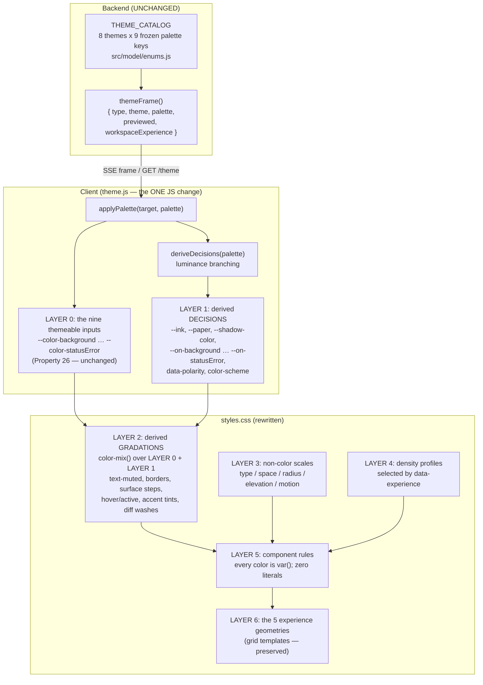
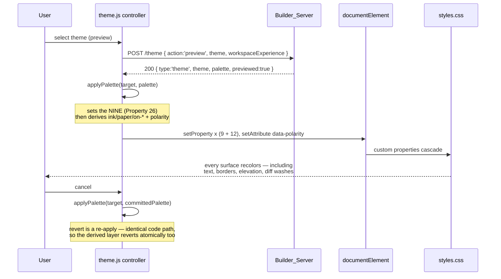

> ## ⚠ SUPERSEDED IN PART — read `PLAN.md` first
>
> This document was written when the rewrite was scoped as **presentation only**
> (a restyle of one shared screen). That scope was wrong. The agreed direction is
> **Vibe mode and IDE mode as distinct interfaces over one shared project, with
> Preview as its own full-bleed screen** — see `PLAN.md`, which is authoritative.
>
> **Still valid here:** the derived colour system (nine themeable inputs, everything
> else derived), the WCAG AA contrast fix, and the type / space / radius / elevation
> / motion scales. Those are built and tested.
>
> **No longer valid here:** anything describing the region grid, the five
> per-experience geometries, the canvas + sheet Stage, or the preview as a panel
> beside the agent.

# Design Document: UI Redesign

## Overview

This is a total rewrite of the **visual layer** of the `ai-app-builder` Web UI. The user's assessment — "it looks like AI slop" — is accurate, and the cause is diagnosable. It is not a series of bad taste calls. It is the **absence of a design system**. The shipped stylesheet defines fifteen custom properties total: nine palette colors and six geometry values. There is no text color token, no type scale, no elevation, no motion, no spacing scale, no radius hierarchy, and no border or state vocabulary. Nine hues are being asked to carry an entire interface, and they cannot. Everything downstream of that — blue body copy, identical flat cards, buttons with no hierarchy, no feedback on hover — follows mechanically from it.

The fix is to build the missing system, then restyle the surfaces against it. The chosen direction is **Precise Technical Instrument**: the register of a well-made developer tool, where near-neutral values carry the surfaces, color is rationed to one job per screen, hairline borders do separation instead of filled cards, one crisp elevation level exists for things that genuinely float, and motion is short and only ever explains a state change. This direction was chosen over editorial and brutalist alternatives because the content this UI carries is an agent build log, code diffs, tool calls, and a live preview — dense machine output that rewards precision and legibility, and because a grey-led system is the only one of the four that survives all eight named themes intact.

The work is **presentation only**. Every functional contract the existing `web-ui` spec defines — SSE frame types, the endpoint surface, auth and token behavior, preview polling, non-disclosing error handling — is fixed and untouched. Exactly one JavaScript function changes (`theme.js` `applyPalette`, to emit derived tokens alongside the nine it already sets), one HTML file gains a font preload, one view gains a single `data-status` attribute, and the stylesheet is rewritten. Nothing else in the ~8,000 lines of shipped client code needs to move.

---

## Scope

### In scope

- A complete token system: color derivation, type scale, spacing scale, rhythm/density, radius hierarchy, elevation, motion.
- A rewritten `styles.css` authored against that system.
- Derived-token emission in `theme.js` `applyPalette` (the one JS change).
- A self-hosted display/UI typeface as progressive enhancement, with a designed system-stack fallback.
- Per-surface restyling of all shipped surfaces: session header, activity stream, prompt/compose, preview pane, confirm cards, file panel, project form, settings, workspace controls.
- Keeping all five Workspace Experience geometries genuinely distinct, and all eight themes rendering correctly.

### Out of scope (explicitly)

- **Any backend change.** No endpoint, frame type, palette catalog, or layout descriptor is modified.
- **Any functional behavior change.** No new state, no new user setting, no new persisted preference.
- **A user-message kind in the Activity Stream.** The activity model has five kinds (`reasoning`, `text`, `tool`, `diff`, `status`) and none of them represents the user's own submitted prompt, so the feed reads one-sided. This is a real product observation but fixing it means changing the activity model or echoing into the store — a functional change. Flagged in *Open decisions*, not designed here.
- **Iconography.** The shipped views render no icons at all. Adding an icon set is a defensible follow-on but it is new content, not a restyle. The design compensates with type weight, mono, and status color.
- **A login screen.** None exists (`auth.js` owns the flow, the shell gates on token presence). This redesign does not invent one.

---

## Diagnosis

Every finding below was read directly out of `src/server/public/styles.css` (1,338 lines) and the shipped views.

| # | Finding | Evidence | Consequence |
|---|---|---|---|
| 1 | **No foreground color token exists.** | `body { color: var(--color-accent) }` (line 71), and `var(--color-accent)` is used as a text color 26 times total. | Body copy is rendered in whatever the theme's accent hue is. On the default `light` theme that is `#2563eb` — Tailwind blue-600, the single most generic blue available. Blue body copy is the largest single tell. |
| 2 | **No type scale and no type identity.** | One `system-ui` stack (line 70), one mono stack. Sizes appear as ad-hoc one-offs (`0.75rem`, `0.8rem`, `0.85rem`, `0.9rem`, `0.95rem`, `1.1rem`). No weight, tracking, or line-height system. | Nothing establishes hierarchy except size accidents. Headings and body read at the same authority. |
| 3 | **Zero elevation.** | No `box-shadow` declaration exists anywhere in 1,338 lines. | Nothing can float. Confirm prompts, menus, and overlays sit in the same visual plane as static content, so urgency cannot be expressed. |
| 4 | **Zero motion.** | No `transition` and no `animation` declaration exists anywhere. | No state change is ever explained. Hover, focus, disable, and appear all happen instantaneously and identically. |
| 5 | **No spacing scale.** | A single `--space: 1rem`, with `0.25/0.35/0.4/0.5/0.6/0.75/0.9/1.25rem` scattered as literals. | No vertical rhythm. Density is accidental and inconsistent between surfaces. |
| 6 | **No radius hierarchy.** | `--radius: 0.75rem` and `--radius-sm: 0.5rem`, with `--radius` applied to essentially every container. | Every surface reads as the same object. A 12px radius on everything is itself a strong "AI default" signal. |
| 7 | **No border, muted, or state tokens.** | Borders are all `1px solid var(--color-badge)` — the badge *fill* color pressed into service as a border. No hover, active, or muted token exists. | Surface separation and interaction feedback have no vocabulary, so neither exists. |

### The measured failure

Finding 1 is not only a taste problem. Because `body` text is the accent color, body text contrast is determined by the theme's accent-on-background ratio. Computed across the real `THEME_CATALOG` (WCAG 2.x relative luminance):

| Theme | Base | Accent on background | Accent on surface | Body-text verdict |
|---|---|---|---|---|
| `light` | light | 5.17:1 | 4.78:1 | AA pass |
| `dark` | dark | 7.53:1 | 6.78:1 | AA pass |
| `pastel-pasture` | light | **2.15:1** | **1.98:1** | **AA fail** |
| `out-there` | dark | 13.16:1 | 11.91:1 | AA pass |
| `paranormal-purple` | dark | 5.59:1 | 5.05:1 | AA pass |
| `morning-dew` | light | **2.36:1** | **2.16:1** | **AA fail** |
| `summer-sunset` | light | **2.63:1** | **2.37:1** | **AA fail** |
| `peach-popsicle` | light | **2.14:1** | **1.88:1** | **AA fail** |

**Body text fails WCAG AA on four of the eight shipped themes**, by a wide margin. The four pastel light themes are effectively unreadable as specified. This converts the redesign from a preference into a defect fix, and it fixes itself the moment a real foreground token exists — which is the first thing the new system introduces.

*Full WCAG conformance cannot be established by computation alone. These ratios are machine-checkable and will be enforced by test, but complete validation requires manual testing with assistive technologies and expert accessibility review.*

---

## Direction: Precise Technical Instrument

Seven rules that turn the chosen register into decisions an implementer can follow. These are the design; the tokens are just their encoding.

1. **Neutrals carry the layout; the palette accents it.** Surfaces, borders, and text derive from a neutral axis anchored to the theme's own background. The nine palette hues are used for identity, status, and the single primary action — never to hold structure together.
2. **One accent job per screen.** The accent color marks the single most important action or the active state, and nothing else. Where the current UI paints five things accent-blue, the new one paints one.
3. **Separation by hairline, not by fill.** Surfaces are distinguished by a 1px derived border and, where needed, a one-step surface shift. Filled cards are reserved for content that is genuinely a distinct object (a confirm prompt, a diff block).
4. **Elevation means "floats", and only three levels exist.** Level 0 is in-plane. Level 1 is a resting panel edge. Level 2 is something that has left the plane and demands an answer. Nothing else gets a shadow.
5. **Mono is semantic, not decorative.** Monospace means "this is a literal": a path, a command, a diff line, a URL. Prose is never mono, and literals are never not.
6. **Motion under 160ms, and only for state change.** Hover, focus, disable, expand, and appear get a transition. Nothing animates on load. `prefers-reduced-motion` collapses all of it.
7. **Density is rhythm, not scale.** The type and space scales are fixed. Density changes the *gaps between and inside surfaces* only, so a compact workbench and a comfortable chat column share one type system.

### On the two "both" answers

The direction question came back with **both densities and both typography answers selected**. Both are resolvable without fudging, and both resolutions are deliberate:

- **Density — both, derived per experience, no new setting.** Two rhythm profiles are shipped (`compact`, `comfortable`) and selected in CSS from the `data-experience` attribute `views/layout.js` already sets. `technical-workbench` gets compact; `vibe-first` and `mobile-command-center` get comfortable; `kiro-style` and `custom` sit between. This makes both real with **zero** new state, zero new endpoint, and zero backend change — which the scope boundary requires. The alternative reading (a user-facing density toggle) is a functional addition and is flagged in *Open decisions* rather than silently built.
- **Typography — both, as enhancement plus designed fallback.** A self-hosted variable `woff2` is the display/UI face, and the system stack behind it is designed as a first-class target rather than a degradation. The font is a static asset loaded `font-display: swap`; if it never lands, the UI is complete and correct on system stacks alone. Both answers are true simultaneously and neither is a compromise.

---

## The nine-token tension, and how it is resolved

This is the hard constraint in the whole design and it is addressed head-on rather than quietly violated.

### The existing contract

`web-ui` **Requirement 9** and design **Property 26** lock the themeable surface to exactly nine CSS custom properties, mapping 1:1 onto `THEME_CATALOG` palette keys, applied at runtime by `theme.js` `applyPalette` through the CSSOM on `document.documentElement`. Property 26 reads: *"applying it sets all nine CSS custom properties … to the frame palette's corresponding values, so every `var(--color-*)`-styled element resolves to the new value."*

A real design system needs more tokens than nine. So does the contract break?

### It does not — but not for the reason first claimed

**Correction, found by running the shipped test.** This document originally argued
that Property 26 was a completeness assertion rather than an exclusivity one, and
that the derived tokens could therefore ride inside `applyPalette`. That was wrong.
`test/web-ui-theme-palette.property.test.js` line 90 asserts
`target.size() === PALETTE_KEYS.length` — **exactly nine** custom properties on the
surface. Folding the derived writes into `applyPalette` breaks it, and did.

The resolution is a **separate function**: `applyPalette` keeps its narrow
nine-property contract untouched, and `applyDerivedDecisions(target, palette,
element)` emits the derived layer alongside it. The controller calls both. In the
browser both receive the same `documentElement.style`, so the cascade sees one
merged set; only the *contract of `applyPalette`* stays narrow. Property 26 holds
verbatim, with no edit to any shipped test.

With that correction, the themeable contract still is not widened — everything else
is **derived from the nine**:

> **The nine palette keys remain the single source of truth and the only themeable input. Every other token in the system is a pure function of those nine. No new themeable input is introduced, no frame field is added, no backend data changes, and Property 26 continues to hold verbatim.**

That gives a two-stage derivation:

- **Decisions** — the small set of choices CSS cannot make cheaply, because they require branching on a color's luminance. Chiefly: *is this palette light or dark*, and *for each palette fill, does readable text on it want the dark anchor or the light anchor*. These are computed in JS inside `applyPalette` and emitted as additional custom properties plus a `data-polarity` attribute.
- **Gradations** — every muted text level, border weight, surface step, hover state, accent tint, and diff wash. These are pure CSS `color-mix()` expressions over the nine inputs and the two anchors. No JS involved.

### Why derive polarity rather than read it

`THEME_CATALOG` entries carry a `base: 'light' | 'dark'` flag, but `themeFrame()` does **not** include it — the frame is `{ type, theme, palette, previewed, workspaceExperience }`. Adding `base` to the frame would be a backend change, and duplicating the catalog client-side would be data duplication of exactly the kind the anti-lock-in steering warns about. So polarity is computed from the palette's own `background` luminance. This is strictly better than reading the flag: it is correct for any palette, including a future theme, and it needs nothing from the server.

### The tradeoff, stated plainly

**What is gained:** a full design system, no backend change, no new themeable contract, Property 26 intact, and eight themes that stay correct because every derived value is anchored to the theme's own colors.

**What is given up:** the derived layer is *not individually themeable*. A theme author cannot say "in Peach Popsicle, make muted text a little warmer" — they can only move the nine inputs and let derivation follow. That is the right trade for this product (the catalog is closed and spec-governed, and per-theme hand-tuning is exactly the maintenance burden that produces drift), but it is a real limitation. If per-theme override ever becomes necessary, the honest path is a spec change that widens `THEME_CATALOG`, not a pile of theme-specific CSS.

**One structural consequence:** the derived layer must be *robust for arbitrary nine-color inputs*, not tuned to the eight that exist. A palette whose `background` and `surface` are nearly identical, or whose `button` sits in the mid-luminance dead zone, still has to produce a usable interface. The derivation rules and their property tests are written against that generality.

---

## Architecture

### The token pipeline



The pipeline has one property worth naming: **information only ever flows down**. A component rule can never introduce a color, only consume a token. That is what makes the eight-theme guarantee mechanical rather than a matter of vigilance, and it is enforced by an existing test (see below).

### Theme apply, unchanged in shape



The revert path is worth calling out: because the derived layer is a *pure function* of the palette, reverting a preview requires no bookkeeping. Re-applying the committed palette restores every derived token by construction, so Property 27 (preview-then-cancel is the identity on the committed palette) extends to the whole new token layer for free.

---

## Load-bearing constraints

Each of these is verified in the repo, and each has a named enforcer. The redesign is bounded by them.

| Constraint | Detail | Enforced by |
|---|---|---|
| **No runtime dependency** | Zero runtime deps; `fast-check` is the only devDependency. No CSS framework, no build step, no preprocessor. Vanilla CSS + vanilla ES modules. | `package.json`; the existing dependency smoke test; `.kiro/steering/anti-lock-in.md` |
| **No hex literals below `.shell {`** | `web-ui-mobile-command-center.integration.test.js` slices the stylesheet from the first `.shell {` and asserts every hex found is `#ffffff` (the QR scaffold). | Existing test. **Design consequence: all raw color values live in one `:root` block placed above `.shell {`. Component rules and per-theme tuning may not contain literals — ever.** |
| **Per-experience geometry declarations** | `web-ui-layout-geometry.test.js` asserts each experience declares a real, pairwise-distinct grid template; the workbench declares `"sidebar editor"` / `"dock dock"`; `.shell` is `overflow-x: hidden`; `.shell__region` is `min-width: 0` / `max-width: 100%`; `[data-emphasis="primary"]` references `var(--color-accent)`. | Existing test. The rewrite preserves these selectors and declarations. |
| **360px, no horizontal overflow** | Same test asserts the `box-sizing: border-box` reset (exact regex), `.shell__main { min-width: 0; width: 100% }`, a `[data-single-column="true"]` rule, and an `@media (max-width: 720px)` collapse. | Existing test. These declarations are load-bearing text, not incidental. |
| **CSP: `script-src 'self'`, `style-src 'self'`** | No inline `<script>`, no inline `<style>`, no inline event handlers, no external origin. Themes must keep applying through the CSSOM. | `web-ui-final-csp.integration.test.js` |
| **Fixed asset allow-list** | `STATIC_ASSETS` in `builder-server.js` is a fixed map; `CONTENT_TYPE_BY_EXT` maps extension to type; the CSP test carries an explicit `ASSET_PATHS` list. | Existing test. **Any new asset (a font file) requires three coordinated edits: `STATIC_ASSETS`, `CONTENT_TYPE_BY_EXT`, and `ASSET_PATHS`.** |
| **`font-src 'self'`** | Already present in `securityHeaders()`. A same-origin `woff2` is CSP-legal; a webfont CDN is not. | `securityHeaders()` |
| **Touch targets ≥44px** | `--touch: 2.75rem` on every control a user taps. | Existing tests + Req 11.3 |
| **Diff marker is data, not color** | `views/activity-stream.js` writes `data-marker` and a textual `+`/`-` span. The restyle may add color and a tinted gutter but must not remove the textual marker. | Req 3.4, Property 6 |
| **Eight themes, five geometries** | All eight palettes and all five layout descriptors must render correctly. | Req 8, 9; `layouts.js` |

---

## Components and Interfaces

Every shipped module is classified below as **untouched**, **restyled** (CSS only, no JS edit), or **edited** (JS/HTML change). The count of edited files is deliberately tiny: the whole redesign is carried by the stylesheet plus one function.

### Edited (3 files)

#### `theme.js` — `deriveDecisions(palette)` + `applyPalette` emission

The one JS change in the redesign. `applyPalette` keeps its existing signature and its existing Property-26 behavior verbatim, then emits the derived decision layer.

```js
// New, pure, DOM-free — unit- and property-testable in isolation.
deriveDecisions(palette) -> {
  polarity:    'light' | 'dark',   // from relative luminance of palette.background
  colorScheme: 'light' | 'dark',   // mirrors polarity; drives form-control rendering
  ink:         '#rrggbb',          // dark anchor, hue-nudged toward palette.background
  paper:       '#rrggbb',          // light anchor, hue-nudged toward palette.background
  shadowColor: '#rrggbb',          // always derived from ink, never pure black
  on: {                            // readable foreground for each of the 6 fills
    background, surface, accent, button, badge,
    statusInfo, statusSuccess, statusWarning, statusError
  }
}
```

`applyPalette(target, palette)` becomes:

1. Set the **nine** themeable inputs from `palette` — unchanged, Property 26 holds verbatim.
2. Call `deriveDecisions(palette)`.
3. Set **12** further custom properties: `--ink`, `--paper`, `--shadow-color`, and the nine `--on-*`.
4. Set `data-polarity` on the target and the `color-scheme` property.

Two invariants: the function stays **pure with respect to the palette** (same nine inputs always produce the same 21 outputs plus attribute), and it performs **no reads of prior state**, so a preview revert is just a re-apply. That is what extends existing Property 27 to the derived layer for free.

`--ink` and `--paper` are chosen per-palette rather than fixed `#000`/`#fff` because a fixed neutral against a warm pastel background reads dirty. Each anchor is pulled a small, bounded amount toward the palette's own background hue, with a floor on the resulting contrast so the nudge can never cost legibility.

#### `index.html` — font preload

Adds one `<link rel="preload" as="font" type="font/woff2" crossorigin>` and the same-origin `woff2` reference. No inline `<style>`, no inline `<script>`, no external origin. Nothing else in the shell changes.

#### One view — a single `data-status` attribute

The preview pane's status is currently expressed only as text. The restyle needs it as a selectable hook, so the view writes `data-status="loading|ready|error|showing_prior|persistent_failure"` on the pane root. Attribute only: no new state, no new store slice, no change to what is rendered or when.

### Rewritten (1 file)

#### `styles.css`

Rewritten from scratch against the layer order in the Architecture diagram. Hard structural rule, enforced by an existing test: **all raw color values live in a single `:root` block placed above the first `.shell {`**. Everything below that point references `var()` only and may not contain a hex literal, ever. Component rules consume tokens; they never introduce color.

### Restyled — CSS only, zero JS edits (9 surfaces)

| Surface | Module | What changes |
|---|---|---|
| Session header | `views/session-header.js` | Slim instrument bar: hairline bottom border, mono for the active Work Mode, one accent mark for the active state only |
| Activity stream | `views/activity-stream.js` | Real hierarchy across the five kinds. `reasoning` recedes to muted; `text` is primary; `tool` is mono on a one-step surface; `diff` is a bordered block with a tinted gutter; `status` uses the status tokens. The textual `+`/`-` marker is preserved |
| Prompt / compose | `views/prompt.js` | The one genuinely elevated resting surface: focus ring, clear disabled state during an in-flight turn, mono-free prose input |
| Preview pane | `views/preview-pane.js` | Framed viewport with a status strip driven by the new `data-status`; restart control is a secondary button, never accent |
| Confirm card | `views/confirm.js` | Elevation level 2 — the only thing on screen that has left the plane, because it is the only thing that blocks. Approve is the single accent action; deny is a bordered ghost |
| File panel | `views/file-panel.js` | Mono paths, hairline rows, no filled cards |
| Project form | `views/projects.js` | Real form rhythm: grouped fields, one primary submit, origin-specific field visually subordinate |
| Settings | `settings/*.js` | Sectioned rows on hairlines instead of stacked cards; masked secret fields read as inert |
| Workspace controls | `views/workspace-controls.js` | Compact segmented pickers for layout and theme |

### Untouched (all remaining client modules)

`app.js`, `api.js`, `sse.js`, `store.js`, `router.js`, `auth.js`, `token-store.js`, `builder.js`, `frames.js`, `preview.js`, `preview-poll.js`, `projects.js`, `qr.js`, `work-mode.js`, `workspace.js`, `confirm.js`, `settings/settings-state.js`, and `views/layout.js`.

`views/layout.js` deserves an explicit note: it keeps emitting `data-experience`, `data-orientation`, `data-regions`, `data-region`, `data-role`, `data-size` and `data-emphasis` exactly as it does today. The density profiles are selected in CSS *from* `data-experience`, which is why shipping both densities costs no new state.

### Backend

Untouched, with one exception that is packaging rather than behavior: adding the font asset requires three coordinated edits — `STATIC_ASSETS` and `CONTENT_TYPE_BY_EXT` in `src/server/builder-server.js`, and `ASSET_PATHS` in the CSP integration test. No endpoint, frame type, palette catalog, or layout descriptor changes.

---

## Data Models

The design system *is* the data model here. Six layers, each a table with real values.

### Layer 0 — the nine themeable inputs (UNCHANGED)

Set by `applyPalette` from the theme frame's palette. The only themeable surface in the system; the single source of truth for every value below.

`--color-background`, `--color-surface`, `--color-accent`, `--color-button`, `--color-badge`, `--color-statusInfo`, `--color-statusSuccess`, `--color-statusWarning`, `--color-statusError`

### Layer 1 — derived decisions (JS, 12 properties + 1 attribute)

Computed by `deriveDecisions`. These exist in JS rather than CSS because each requires branching on a color's luminance, which CSS cannot do.

| Token | Derivation | Purpose |
|---|---|---|
| `--ink` | Near-black, hue-nudged toward `background`, contrast-floored | The dark anchor for all neutral gradation |
| `--paper` | Near-white, hue-nudged toward `background`, contrast-floored | The light anchor |
| `--shadow-color` | From `--ink` at low alpha — never pure black | Elevation that sits in the theme rather than on top of it |
| `--on-background` | `ink` or `paper`, whichever scores higher contrast on `background` | Body text color. **This token is the fix for the AA failures.** |
| `--on-surface` | Same rule against `surface` | Text on the secondary surface |
| `--on-accent` | Same rule against `accent` | Text on accent fills |
| `--on-button` | Same rule against `button` | Primary button label |
| `--on-badge` | Same rule against `badge` | Badge label |
| `--on-statusInfo` | Same rule against `statusInfo` | Label on an info fill |
| `--on-statusSuccess` | Same rule against `statusSuccess` | Label on a success fill |
| `--on-statusWarning` | Same rule against `statusWarning` | Label on a warning fill |
| `--on-statusError` | Same rule against `statusError` | Label on an error fill |
| `data-polarity` | `'dark'` if `background` luminance < 0.5, else `'light'` | Lets CSS branch on theme polarity; also drives `color-scheme` |

### Layer 2 — derived gradations (pure CSS `color-mix()`, no JS)

All in `oklab` for perceptually even mixing. Every one is a function of Layer 0 + Layer 1 only.

| Token | Expression | Use |
|---|---|---|
| `--text` | `var(--on-background)` | Body copy. Replaces the accent-as-text defect |
| `--text-muted` | `on-background` 66% / `background` | Secondary copy, `reasoning` stream lines |
| `--text-subtle` | `on-background` 45% / `background` | Timestamps, hints, disabled labels |
| `--border` | `on-background` 14% / `background` | The default hairline — the main separation device |
| `--border-strong` | `on-background` 26% / `background` | Focused/active edges, diff block frames |
| `--surface-1` | `var(--color-surface)` | One step off the page |
| `--surface-2` | `surface` 60% / `background` | Subtle inset (tool rows, mono blocks) |
| `--surface-3` | `on-background` 6% / `surface` | Pressed/selected row |
| `--hover` | `on-background` 8% / current fill | Hover feedback |
| `--active` | `on-background` 14% / current fill | Press feedback |
| `--accent-tint` | `accent` 12% / `background` | Active-state wash behind the one accent job |
| `--accent-tint-strong` | `accent` 22% / `background` | Selected segmented-control cell |
| `--diff-add-wash` | `statusSuccess` 12% / `background` | Diff added-line background |
| `--diff-del-wash` | `statusError` 12% / `background` | Diff removed-line background |
| `--focus-ring` | `var(--color-accent)` at 2px offset | Single, consistent keyboard focus treatment |

### Layer 3 — non-color scales

**Type.** A 7-step scale. Base is `0.875rem` because this is dense machine output, not prose.

| Token | Size | Line height | Use |
|---|---|---|---|
| `--text-xs` | 0.75rem | 1.4 | Timestamps, badges |
| `--text-sm` | 0.8125rem | 1.45 | Labels, meta |
| `--text-base` | 0.875rem | 1.55 | Body, stream text |
| `--text-md` | 1rem | 1.5 | Emphasis, section leads |
| `--text-lg` | 1.125rem | 1.4 | Surface titles |
| `--text-xl` | 1.375rem | 1.3 | Screen titles |
| `--text-2xl` | 1.75rem | 1.2 | The one hero line |

Weights `--weight-normal: 400`, `--weight-medium: 500`, `--weight-semibold: 600`. Tracking `--tracking-tight: -0.011em` on sizes above `--text-md`, `--tracking-wide: 0.02em` on `--text-xs` caps. Two families: `--font-ui` (self-hosted variable face, then the system stack) and `--font-mono` (`ui-monospace, SFMono-Regular, Menlo, Consolas, monospace`). Mono is semantic — literals only.

**Space.** 8 steps on a 4px base: `--space-0: 0`, `--space-1: 0.25rem`, `--space-2: 0.5rem`, `--space-3: 0.75rem`, `--space-4: 1rem`, `--space-5: 1.5rem`, `--space-6: 2rem`, `--space-7: 3rem`.

**Radius.** A real hierarchy replacing the uniform 12px: `--radius-xs: 3px` (inline code, badges), `--radius-sm: 5px` (inputs, buttons), `--radius-md: 8px` (panels, cards), `--radius-lg: 12px` (the elevated confirm card only), `--radius-full: 999px` (pills, status dots).

**Elevation.** Three levels, no more.

| Token | Value | Meaning |
|---|---|---|
| `--elev-0` | `none` | In-plane. Almost everything |
| `--elev-1` | `0 1px 2px -1px var(--shadow-color)` | A resting panel edge |
| `--elev-2` | `0 8px 24px -8px var(--shadow-color), 0 2px 6px -2px var(--shadow-color)` | Has left the plane and demands an answer. Confirm cards only |

**Motion.** `--dur-fast: 90ms`, `--dur-base: 140ms`, `--ease: cubic-bezier(0.2, 0, 0.38, 1)`. Nothing exceeds 160ms and nothing animates on load. Under `prefers-reduced-motion: reduce` all durations collapse to `1ms`.

### Layer 4 — density profiles

Selected in CSS from the `data-experience` attribute `views/layout.js` already sets. No new state, no new setting, no backend change.

| Token | `compact` | `comfortable` |
|---|---|---|
| `--gap-region` | `--space-2` | `--space-4` |
| `--gap-stack` | `--space-2` | `--space-3` |
| `--pad-surface` | `--space-3` | `--space-5` |
| `--pad-control` | `--space-2` | `--space-3` |
| `--row-h` | 1.75rem | 2.25rem |
| `--stream-leading` | 1.45 | 1.6 |

Assignment: `technical-workbench` → compact. `vibe-first`, `mobile-command-center` → comfortable. `kiro-style`, `custom` → comfortable region gaps with compact interior rows. `--touch: 2.75rem` is a floor in **both** profiles and is never reduced by density.

### Attribute contracts consumed by the stylesheet

| Attribute | Written by | Values |
|---|---|---|
| `data-polarity` | `theme.js` (new) | `light` \| `dark` |
| `data-experience` | `views/layout.js` (existing) | the five experience ids |
| `data-region` / `data-role` / `data-size` / `data-emphasis` / `data-orientation` | `views/layout.js` (existing) | unchanged |
| `data-status` | preview pane view (new attribute only) | `loading` \| `ready` \| `error` \| `showing_prior` \| `persistent_failure` |
| `data-marker` | `views/activity-stream.js` (existing) | `+` \| `-`, alongside the textual span |

---

## Correctness Properties

Each is a single `fast-check` property at >=100 runs, tagged `Feature: ui-redesign, Property {n}: {title}`. Numbering continues the `web-ui` design's 31 so references stay unambiguous.

### Property 32: derivation is a pure function of the nine inputs

For any palette, `deriveDecisions` called twice returns deeply equal results, and no output depends on call order, prior state, or the DOM.

**Validates: Requirements 1.4**

### Property 33: polarity is correct for arbitrary palettes

For any palette, derived `polarity` is `dark` iff the relative luminance of `background` is below the threshold. Generators deliberately include the adversarial cases: `background` and `surface` within 1% luminance of each other, and fills parked in the mid-luminance dead zone where neither anchor is comfortable.

**Validates: Requirements 1.5, 1.8**

### Property 34: every `--on-*` token is the higher-contrast anchor

For any palette and each of the nine fills, the emitted `--on-<fill>` is whichever of `ink`/`paper` scores the higher WCAG contrast ratio against that fill. No fill is ever assigned the losing anchor.

**Validates: Requirements 2.2**

### Property 35: body text meets WCAG AA on arbitrary palettes

For any palette, `--on-background` against `--color-background` is >= 4.5:1, and `--on-surface` against `--color-surface` is >= 4.5:1. This is the property that fixes the shipped defect.

**Validates: Requirements 2.5**

### Property 36: body text meets WCAG AA on all eight shipped themes

The enumerated regression form of Property 35, asserted against the real `THEME_CATALOG`. Documents the four currently-failing themes as fixed: `pastel-pasture`, `morning-dew`, `summer-sunset`, `peach-popsicle`.

**Validates: Requirements 2.3, 2.4**

### Property 37: the anchor hue nudge can never cost legibility

For any palette, the hue-nudged `ink`/`paper` anchors score contrast >= the contrast of un-nudged `#000`/`#fff` minus a fixed bounded tolerance, and never fall below the AA floor.

**Validates: Requirements 2.6**

### Property 38: Property 26 still holds verbatim

For any palette, `applyPalette` sets all nine themeable custom properties to that palette's corresponding values. The derived layer is purely additive; no Layer-0 name is repurposed, renamed, or dropped.

**Validates: Requirements 1.2, 1.7**

### Property 39: preview-then-cancel is the identity over the full token set

For any two palettes, applying the previewed one and then re-applying the committed one restores all 21 custom properties and `data-polarity` to the committed values. Extends `web-ui` Property 27 across the derived layer.

**Validates: Requirements 12.2, 12.3**

### Property 40: no color literal below the token block

The shipped stylesheet, sliced from the first `.shell {`, contains no hex, `rgb()`, `hsl()`, or named-color literal. The sole permitted literal in the whole sheet is the QR scaffold's `#ffffff`. Enforces the one-way information flow of the token pipeline.

**Validates: Requirements 1.6**

### Property 41: all five geometries stay pairwise distinct

For every pair of the five experiences, the declared grid templates differ. The workbench keeps its `"sidebar editor"` / `"dock dock"` template.

**Validates: Requirements 8.1, 8.2**

### Property 42: no horizontal overflow at 360px

For every experience and every theme, at a 360px viewport the primary column's scroll width does not exceed its client width. The `box-sizing: border-box` reset, `.shell { overflow-x: hidden }`, `.shell__region { min-width: 0; max-width: 100% }`, and the `@media (max-width: 720px)` collapse are all present.

**Validates: Requirements 8.3, 8.4**

### Property 43: touch targets never fall below the floor

For both density profiles and every experience, every interactive control resolves to a computed height and width >= `--touch` (2.75rem / 44px). Density may change gaps; it may never shrink a target.

**Validates: Requirements 9.1, 9.2**

### Property 44: the diff marker survives as text

For any diff line, the rendered output contains a textual `+` or `-` span and the `data-marker` attribute. Color and gutter tint are additive only, so add/remove remains distinguishable with color entirely absent.

**Validates: Requirements 10.1, 10.2**

### Property 45: motion respects reduced-motion and stays bounded

No declared transition or animation duration exceeds 160ms, no rule animates on initial load, and under `prefers-reduced-motion: reduce` every duration resolves to <= 1ms.

**Validates: Requirements 6.1, 6.2, 6.3**

### Property 46: elevation is rationed

Only the three elevation tokens appear as `box-shadow` values, and `--elev-2` is used by exactly one component (the confirm card).

**Validates: Requirements 5.1, 5.3, 5.4**

---

## Error Handling

Presentation-layer degradation. None of these paths change functional behavior, and none can leave the interface unreadable.

| Condition | Behavior |
|---|---|
| **Font asset never loads** (404, blocked, slow) | `font-display: swap` renders the designed system-stack fallback immediately. The fallback is a first-class target with its own metric tuning, so layout does not shift materially and no surface breaks. The UI is complete and correct without the font ever arriving. |
| **`color-mix()` unsupported** | An `@supports not (color: color-mix(in oklab, red, blue))` block supplies a flat fallback for the Layer-2 gradations: `--text` falls back to `--on-background`, muted levels to `--on-background`, borders to `--color-badge` (today's behavior), washes to `transparent`. Text stays readable because Layer 1 is emitted by JS, not `color-mix`. Loses subtlety, never legibility. |
| **A palette derives to insufficient contrast** | Cannot occur for the anchors, since `--on-*` always picks the higher-contrast anchor and Property 35 bounds the result. Where a *fill* is itself unusable (a mid-luminance `button`), the derivation applies a bounded luminance push to the fill's `--on-*` pairing rather than tinting the fill, so the palette renders as authored and text stays legible. |
| **`prefers-reduced-motion: reduce`** | All durations collapse to `1ms`. No transform-based or opacity-based entrance remains. Interaction feedback becomes instant rather than absent, so state changes are still perceivable. |
| **Forced colors / high contrast** | A `@media (forced-colors: active)` block yields to system colors: borders become `ButtonBorder`, text `CanvasText`, focus `Highlight`. Elevation drops to `none` and is replaced by a border, since shadows are not rendered in forced-colors mode. The diff marker is unaffected because it is text. |
| **Theme frame arrives malformed** | Unchanged from `web-ui` Req 9.6/9.7 — the last committed palette stays applied and a message is shown. The derived layer inherits this for free: no apply, no derivation. |

---

## Testing Strategy

`fast-check` (already the sole devDependency) under the existing `node --test` runner. No new dependency. Every property runs at `{ numRuns: 100 }` or higher. Real collaborators over mocks: tests exercise the real `deriveDecisions`, the real shipped `styles.css` text, the real `THEME_CATALOG`, and the real layout descriptors from `src/presentation/layouts.js`.

**Unit and property tests.** `deriveDecisions` is pure and DOM-free by construction, so Properties 32–39 run directly under `node --test` with no browser. Contrast math is implemented once as a test helper using the WCAG 2.x relative-luminance formula and reused across Properties 34–37.

**Stylesheet structural tests.** Properties 40, 41, 45, and 46 are assertions over the shipped stylesheet as text — the same technique the existing suite already uses. These need no browser and no server.

**Rendered-geometry tests.** Properties 42 and 43 need layout, so they run the real `views/layout.js` region renderer against the real layout descriptors, matching the approach that produced the existing `req27-*` screenshots.

**Existing tests that must keep passing unchanged.** These encode load-bearing text, not incidental formatting:

- `web-ui-mobile-command-center.integration.test.js` — slices the stylesheet from the first `.shell {` and asserts every hex found is `#ffffff`. **This is why all raw color values must live in one `:root` block above `.shell {`.**
- `web-ui-layout-geometry.test.js` — per-experience pairwise-distinct grid templates, the workbench's `"sidebar editor"` / `"dock dock"`, `.shell { overflow-x: hidden }`, `.shell__region { min-width: 0; max-width: 100% }`, the exact `box-sizing: border-box` reset regex, a `[data-single-column="true"]` rule, the `@media (max-width: 720px)` collapse, and `[data-emphasis="primary"]` referencing `var(--color-accent)`.
- `web-ui-final-csp.integration.test.js` — no inline `<script>`, no inline `<style>`, no inline handlers, no external origin, and the asset allow-list.
- The dependency smoke test — `dependencies` must not grow.

**Font asset coordination.** Adding the `woff2` requires three edits in lockstep or the CSP test fails: `STATIC_ASSETS` and `CONTENT_TYPE_BY_EXT` in `src/server/builder-server.js`, and `ASSET_PATHS` in the CSP test. `font-src 'self'` is already present in `securityHeaders()`, so no header change is needed.

**Visual regression.** Re-render the `.kiro/specs/web-ui/screenshots/` set against the new stylesheet — all eight themes and all five experiences — and keep the pre-redesign images for comparison, as that directory already does for `checkpoint-1`.

**Honest limits.** Computed contrast ratios are machine-checkable and are enforced above, but they are not conformance. Full WCAG validation requires manual testing with assistive technologies and expert accessibility review. Neither can the suite prove perceived quality: it can prove the system is consistent, contrast-safe, non-overflowing, and motion-safe, but whether the result stops looking like AI slop is a judgement only the user can return.
