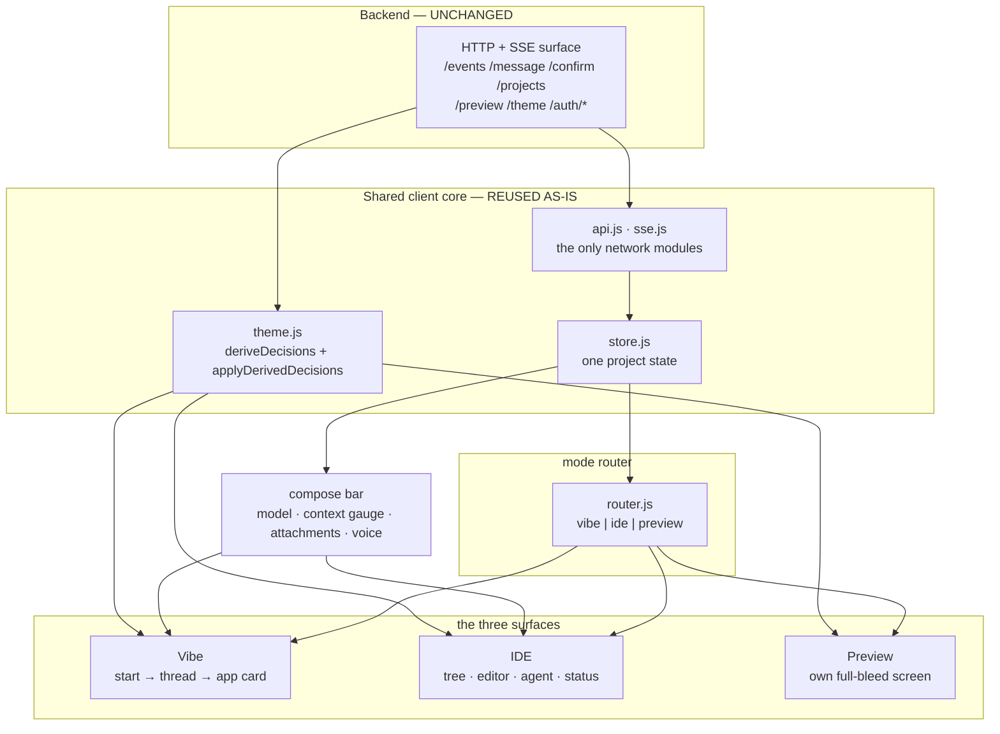

# Design Document: UI Rewrite

Companion to `PLAN.md`, which owns **what** is being built. This document owns
**how**. Nothing here describes a superseded direction; earlier content was deleted
rather than annotated so it cannot mislead a later reader.

## Overview

Three surfaces over one shared project: **Vibe**, **IDE**, and **Preview**. The mode
selects which surface is mounted; it never rearranges a shared screen. All three
consume the same store, the same transport, and the same derived colour system.

Two things are already built and are inputs to this design rather than outputs of it:
the derived colour engine in `theme.js`, and the token scales in `styles.css`.

## Architecture



**Information flows one way.** Surfaces read the store and render; they never own
project state. That is what makes a mode switch free: unmounting Vibe and mounting
IDE touches no data.

## Components and Interfaces

### Mode router — `router.js` (extended)

Owns which surface is mounted. Mode is **presentation state only** and is never sent
to the backend. Surfaces mount lazily and unmount cleanly; the SSE stream, the
in-flight turn, and the preview lifecycle live in the shared core and are unaffected.

### Compose bar — new, shared by Vibe and IDE

One component, two hosts. Parts:

| Part | Behaviour |
|---|---|
| Text input | Grows to a cap, then scrolls. Trim-validated as today (1–10,000 chars) |
| Voice | Hold-to-talk. First-class, not an afterthought |
| Model selector | Pill showing the active model; opens the picker |
| Context gauge | Square filling bottom-up, green → amber → red. Also rendered per model inside the picker |
| Attachments | `+` opens camera / video / photos / files plus recents. Staged items appear as removable thumbnails above the input |
| Autonomy state | Rendered only when hosted by IDE |

### Vibe surface — new

- **Start:** one centred input plus starter cards. No toolbars.
- **Thread:** alternating user message and plain-language reply. Tool calls are
  **aggregated** into a single expandable row (`Changed 3 files`) rather than
  streamed as individual lines — the design's main departure from the old activity
  feed.
- **App card:** a screenshot of the built app with an Open button that routes to
  Preview.

### IDE surface — new

Activity bar, file tree (new = success colour, modified = warning colour), editor
tabs with dirty markers, code view, inline diff, agent panel, status bar. At 430px
and below the code stays the surface and the agent becomes a bottom sheet.

Syntax highlighting is a **small hand-written tokenizer**, not a dependency, because
the zero-dependency constraint is absolute. It only needs the languages the builder
emits.

### Preview surface — reuses existing controllers

Full-bleed, with browser-style chrome and a bottom Preview / Chat / Files switch.
`preview.js`, `preview-poll.js` and `qr.js` are consumed unchanged.

### Theming UI — new, over the existing engine

A palette picker for the catalogue and a custom editor exposing the **nine** inputs.
Everything else derives. Preview-then-commit is unchanged, and revert is a re-apply
of the committed palette, which restores the whole derived layer by construction.

### Colour system — built, do not reimplement

`deriveDecisions(palette)` is pure and DOM-free. It derives, from nine inputs:
polarity, the `ink`/`paper` anchors, a shadow tint, and a readable foreground for
each of the nine fills. Anchors are hue-nudged toward the palette's own background,
bounded and contrast-floored, with pure black/white as a guaranteed fallback.

`applyPalette` and `applyDerivedDecisions` are **deliberately separate functions**.
The shipped `web-ui-theme-palette.property.test.js` asserts *exactly* nine custom
properties on the surface, so merging them breaks a shipped contract. In the browser
both receive the same `documentElement.style`; only the contract of `applyPalette`
stays narrow.

Derived colours live in the `--color-*` namespace in **camelCase**
(`--color-textMuted`, never `--color-text-muted`) so stylesheet rules satisfy the
palette-driven assertion, which matches `var(--color-[A-Za-z]+)` — letters only.

## Data Models

### Token layers

| Layer | Contents | Set by |
|---|---|---|
| 0 | The nine themeable inputs | `applyPalette` |
| 1 | `--color-ink`, `--color-paper`, `--color-shadow`, nine `--color-on*`, `--is-dark`, `color-scheme` | `applyDerivedDecisions` |
| 2 | `--color-text`, `textMuted`, `textSubtle`, `border`, `borderStrong`, `surfaceRaised`, `surfaceSunken`, `surfaceSelected`, `hover`, `active`, `accentTint`, `accentTintStrong`, `diffAdd`, `diffDel`, `focusRing` | `color-mix()` in the stylesheet |
| 3 | Type (7 steps), space (8 steps), radius (5 steps), elevation (3 levels), motion (≤140ms) | Stylesheet `:root` |

All raw literals live in one `:root` block above the first shell rule. No rule below
it may contain a colour literal — the sole exception is the QR scaffold's `#ffffff`,
which must be true monochrome to scan.

### Context gauge

```
{ model: string, used: number, limit: number|null, estimated: true }
```

`limit: null` renders an indeterminate gauge rather than a wrong number. `estimated`
is always true until real per-model accounting lands, and the copy must say so.

### Autonomy

```
{ level: 'ask' | 'auto' | 'full',
  plan: [{ n, text, state: 'done'|'current'|'pending' }],
  autoApproved: string[],
  running: boolean }
```

## Correctness Properties

Numbering continues the shipped `web-ui` set. Properties 32–39 already exist and pass
in `test/ui-redesign-derive-decisions.property.test.js`.

### Property 47: mode switching is presentation only

For any sequence of mode switches, project state — files, conversation, preview
status, in-flight turn — is byte-identical before and after.

**Validates: Requirements 1.1, 1.2**

### Property 48: the context gauge never misreports

For any `used`/`limit` pair the rendered fill fraction equals `used/limit` clamped to
`[0,1]`, the colour band follows fixed thresholds, and a null limit renders
indeterminate rather than zero or full.

**Validates: Requirements 3.2, 3.3**

### Property 49: autonomy never widens blast radius

For every autonomy level including `full`, a destructive command still requires
explicit approval.

**Validates: Requirements 5.3, 5.4**

### Property 50: user palettes stay readable

For any user-authored palette, body text on the background and on the surface both
meet WCAG AA. Reuses the shipped derivation properties.

**Validates: Requirements 6.2, 6.3**

### Property 51: no colour literal below the token block

The shipped stylesheet, sliced from the first shell rule, contains no colour literal
except the QR scaffold's `#ffffff`, and every colour declaration reads a
`var(--color-*)`.

**Validates: Requirements 6.1, 7.2**

### Property 52: no horizontal overflow at 360px

Every surface renders at 360px without the primary column exceeding its client
width, and every interactive control meets the 44px touch floor.

**Validates: Requirements 7.3, 7.4**

### Property 53: diff markers survive without colour

Added and removed lines carry a textual `+`/`-` and remain distinguishable with
colour entirely absent.

**Validates: Requirements 7.5**

## Error Handling

| Condition | Behaviour |
|---|---|
| Attachment too large or unsupported | Reject before upload, name the limit, keep the prompt text |
| Model unavailable | Keep the previous model selected, surface the failure, never silently switch |
| Context limit unknown | Indeterminate gauge; never a fabricated number |
| Autonomy hits a destructive command | Halt, ask, keep the plan resumable |
| Stop pressed mid-run | Halt before the next step; completed work stands |
| `color-mix()` unsupported | `@supports` fallback to flat values; text stays readable because Layer 1 comes from JavaScript |
| Forced colours | Yield to system colours; elevation becomes a border |
| Reduced motion | All durations collapse to 1ms |
| Access denied | Unchanged: one generic denial, no resource-existence disclosure |

## Testing Strategy

`fast-check` under `node --test`, ≥100 runs per property, real collaborators over
mocks. No new dependency.

Pure logic — derivation, gauge maths, autonomy gating, mode-switch invariance — is
factored DOM-free so it runs without a browser. Rendered checks (360px, touch
targets, geometry) run the real view modules against the real stylesheet text, the
technique the surviving suite already uses.

**Invariants inherited from three deleted tests** must be carried by whatever
replaces the interim shell, not dropped: no 360px overflow, touch sizing,
palette-driven colour, and CSP cleanliness. They currently live in
`test/ui-redesign-shell.test.js`.

**Honest limits.** Computed contrast is machine-checkable and enforced, but it is not
conformance; full WCAG validation needs manual testing with assistive technologies
and expert review. The suite can prove the system is consistent, contrast-safe,
non-overflowing and motion-safe. It cannot prove the result looks good.
