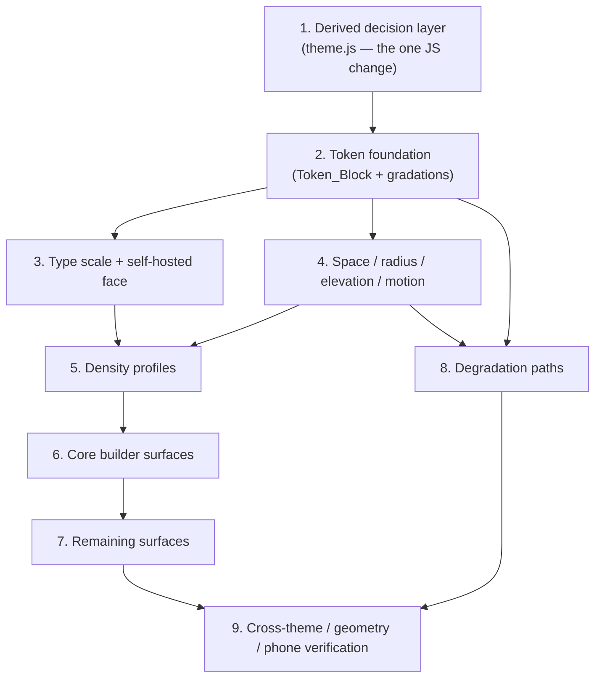

# Implementation Plan: UI Redesign

## Overview

This plan rewrites the **visual layer** of the `ai-app-builder` Web UI against the Design_System specified in `design.md`, in the direction **Precise Technical Instrument**. It is ordered so the defect is fixed first, the system is built second, and the surfaces are restyled third — with the core builder screen ahead of settings, so the screen that matters is right early.

The shape of the change is deliberately narrow: **one JavaScript function**, **one HTML line**, **one new attribute**, and **the stylesheet**. Everything else is CSS.

### Verified starting state

- `src/server/public/theme.js` exports `applyPalette(target, palette)` at line 127 and `PALETTE_KEYS` / `CSS_VAR_NAMES`. The controller re-applies via `applyActive()` / `applyCommitted()`, so a revert already routes through the same function.
- `src/server/public/styles.css` is 1,338 lines with 15 custom properties and zero shadows, transitions, or animations.
- `views/activity-stream.js` already writes `lineEl.dataset.marker` plus a textual `<span class="activity__diff-marker">`. The marker is data in the DOM today and must stay that way.
- `src/server/builder-server.js` has `STATIC_ASSETS` (line 100), `CONTENT_TYPE_BY_EXT` (line 146), and `font-src 'self'` already in `securityHeaders()` (line 168).
- 46 `web-ui-*` test files exist and pass. The suite is 1037 tests / 1029 pass / 0 fail / 8 skipped.

### Constraints honored by every task

- **No new dependency.** No runtime dependency, no devDependency, no CSS framework, no build step, no bundler, no preprocessor. Property tests use `fast-check` (the existing sole devDependency) under `node --test`.
- **No backend behavior change.** The only server edits in this plan are two entries registering a font asset. No endpoint, frame type, `THEME_CATALOG` entry, or layout descriptor is modified.
- **CSP.** No inline `<script>`, no inline `<style>`, no inline handlers, no external origin. Themes keep applying through the CSSOM.
- **All raw color literals live in one `:root` Token_Block above the first `.shell {`.** `web-ui-mobile-command-center.integration.test.js` slices the sheet at `.shell {` and fails on any hex below it except the QR scaffold's `#ffffff`.
- **Load-bearing stylesheet text is preserved verbatim.** `web-ui-layout-geometry.test.js` asserts the exact `box-sizing: border-box` reset, `.shell { overflow-x: hidden }`, `.shell__region { min-width: 0; max-width: 100% }`, a `[data-single-column="true"]` rule, the `@media (max-width: 720px)` collapse, pairwise-distinct per-experience grid templates, the workbench's `"sidebar editor"` / `"dock dock"`, and `[data-emphasis="primary"]` referencing `var(--color-accent)`.
- **Coding tasks only.** Property tests are tagged `Feature: ui-redesign, Property {n}: {title}` and run at `{ numRuns: 100 }` or higher.

### Out of scope

No backend change beyond font registration, no functional behavior change, no new user setting or persisted preference, no icon set, no login screen, and no user-message kind in the Activity Stream (that would require changing the activity model, which is a functional change — see *Out of scope* in `design.md`).

## Tasks

- [ ] 1. The derived decision layer — fix the contrast defect at its source
  - [ ] 1.1 Implement `deriveDecisions(palette)` as a pure, DOM-free function
    - Add to `src/server/public/theme.js`: relative-luminance and WCAG contrast helpers, Polarity derivation from `palette.background`, `--ink` / `--paper` Anchor derivation with a bounded hue nudge toward `background` and a contrast floor, `--shadow-color` from `--ink`, and the nine `--on-*` foregrounds each selecting the higher-contrast Anchor
    - Export it so tests exercise the real function; take no DOM argument and read no prior state
    - _Requirements: 1.4, 1.5, 2.1, 2.2, 2.6, 2.7_
  - [ ] 1.2 Emit the derived layer from `applyPalette`
    - Keep the existing nine-property write exactly as-is, then set the twelve Derived_Decisions, the `data-polarity` attribute, and `color-scheme` on the same target
    - Additive only: do not rename, repurpose, or drop any Layer-0 name, so `web-ui` Property 26 holds verbatim and `web-ui-theme-palette.property.test.js` keeps passing
    - _Requirements: 1.1, 1.2, 1.3, 1.7, 12.1, 12.4_
  - [ ]* 1.3 Property tests for derivation purity and polarity
    - Property 32 (derivation is a pure function of the nine inputs) and Property 33 (polarity correct for arbitrary palettes), with generators covering `background`/`surface` within 1% luminance and mid-luminance dead-zone fills
    - _Requirements: 1.4, 1.5, 1.8_
  - [ ]* 1.4 Property tests for the contrast fix
    - Property 34 (every `--on-*` is the higher-contrast Anchor), Property 35 (AA on arbitrary palettes), Property 36 (AA on all eight shipped themes, asserted against the real `THEME_CATALOG`, documenting `pastel-pasture` / `morning-dew` / `summer-sunset` / `peach-popsicle` as fixed), Property 37 (the hue nudge never costs legibility)
    - Implement the WCAG relative-luminance helper once and share it
    - _Requirements: 2.2, 2.3, 2.4, 2.5, 2.6_
  - [ ]* 1.5 Property tests for contract preservation and revert
    - Property 38 (all nine still set from the frame palette; derived layer purely additive) and Property 39 (preview-then-cancel restores all 21 properties and `data-polarity`, extending `web-ui` Property 27)
    - Exercise the real controller `applyActive()` / `applyCommitted()` path, not a stand-in
    - _Requirements: 1.2, 1.7, 12.2, 12.3_

- [ ] 2. The token foundation in the stylesheet
  - [ ] 2.1 Author the Token_Block
    - Rewrite the `:root` block at the top of `src/server/public/styles.css`, above the first `.shell {`, holding the nine Palette_Input bootstrap fallbacks and every non-color scale
    - This is the only place in the sheet permitted to contain a raw color literal
    - _Requirements: 1.6, 11.2_
  - [ ] 2.2 Define the Derived_Gradation layer
    - Add the `color-mix(in oklab, …)` tokens from the design's Layer-2 table: `--text`, `--text-muted`, `--text-subtle`, `--border`, `--border-strong`, `--surface-1..3`, `--hover`, `--active`, `--accent-tint`, `--accent-tint-strong`, `--diff-add-wash`, `--diff-del-wash`, `--focus-ring`
    - Every expression references Palette_Inputs and Derived_Decisions only
    - _Requirements: 1.1, 2.7, 4.5_
  - [ ] 2.3 Replace accent-as-text globally
    - Change `body { color: var(--color-accent) }` to `var(--text)` and convert all 26 accent-as-text uses to the appropriate text gradation
    - _Requirements: 2.1, 2.7, 14.2_
  - [ ]* 2.4 Structural test: no color literal below the Token_Block
    - Property 40 — slice the shipped sheet from the first `.shell {` and assert no hex, `rgb()`, `hsl()`, or named-color literal appears, with `#ffffff` on the QR scaffold the sole exception
    - _Requirements: 1.6_

- [ ] 3. Type scale and the self-hosted face
  - [ ] 3.1 Author the type scale and apply it
    - Add the seven size/line-height steps, the three weight tokens, the tracking tokens, and `--font-ui` / `--font-mono`; replace every ad-hoc size in the sheet with a scale step
    - Apply `--font-mono` semantically to paths, commands, diff lines, and URLs, and to nothing else
    - _Requirements: 3.1, 3.2, 3.3, 3.4_
  - [ ] 3.2 Add the self-hosted variable font and its designed fallback
    - Place the `woff2` under `src/server/public/`, declare `@font-face` with `font-display: swap`, and put the system stack behind it as a first-class target
    - _Requirements: 3.5, 3.6, 3.7, 13.3_
  - [ ] 3.3 Register the font asset in all three coordinated places
    - Add the path to `STATIC_ASSETS` and the `.woff2` type to `CONTENT_TYPE_BY_EXT` in `src/server/builder-server.js`, and add the path to `ASSET_PATHS` in `test/web-ui-final-csp.integration.test.js`
    - Add the `<link rel="preload" as="font" type="font/woff2" crossorigin>` to `index.html`; no inline style or script
    - `font-src 'self'` is already present in `securityHeaders()`, so no header change
    - _Requirements: 3.5, 3.8, 11.3_
  - [ ]* 3.4 Integration test the font asset under the real CSP
    - Assert the `woff2` serves `200 font/woff2` with the `securityHeaders()` CSP, that the asset allow-list still rejects unknown paths, and that no external origin is referenced anywhere in the asset set
    - _Requirements: 3.5, 3.8, 11.3_

- [ ] 4. Space, radius, elevation, motion
  - [ ] 4.1 Apply the space scale and radius hierarchy
    - Replace the single `--space` and the scattered literals with the eight-step scale; assign the five radius steps by surface role, retiring the uniform 12px
    - Convert surface separation to the derived hairline border, keeping filled treatments only for genuinely distinct objects
    - _Requirements: 4.1, 4.2, 4.3, 4.4, 4.5_
  - [ ] 4.2 Add the three elevation levels
    - Define `--elev-0/1/2` with `--shadow-color`, apply `--elev-1` to resting panel edges and `--elev-2` to the confirm card only
    - _Requirements: 5.1, 5.2, 5.3, 5.4_
  - [ ] 4.3 Add motion and the focus treatment
    - Define `--dur-fast`, `--dur-base`, `--ease`; apply transitions to hover, focus, disable, expand, and appear only, with nothing animating on load
    - Add the single `--focus-ring` treatment to every interactive control and a `prefers-reduced-motion: reduce` block collapsing all durations to `1ms`
    - _Requirements: 6.1, 6.2, 6.3, 6.4_
  - [ ]* 4.4 Structural tests for elevation and motion
    - Property 46 (only the three elevation tokens appear as `box-shadow` values; `--elev-2` used by exactly one component) and Property 45 (no duration exceeds 160ms, nothing animates on load, reduced-motion collapses everything)
    - _Requirements: 5.1, 5.3, 5.4, 6.1, 6.2, 6.3_

- [ ] 5. Density profiles
  - [ ] 5.1 Implement the two profiles keyed off `data-experience`
    - Add the `compact` and `comfortable` token sets from the design's Layer-4 table and select them in CSS from the existing `data-experience` attribute — `technical-workbench` compact, `vibe-first` and `mobile-command-center` comfortable, `kiro-style` and `custom` mixed
    - Change nothing in `views/layout.js`; add no state, setting, endpoint, or persisted preference
    - Hold `--touch: 2.75rem` as a floor in both profiles
    - _Requirements: 7.1, 7.2, 7.3, 7.4, 7.5, 7.6, 9.2_

- [ ] 6. Restyle the core builder surfaces
  - [ ] 6.1 Activity stream
    - Give the five kinds distinct authority: `reasoning` muted, `text` primary, `tool` mono on `--surface-2`, `diff` a bordered block with a tinted gutter using the wash tokens, `status` on the status tokens
    - Preserve the `dataset.marker` write and the textual `activity__diff-marker` span exactly; color and gutter are additive only
    - _Requirements: 10.1, 10.2, 14.1, 14.3_
  - [ ] 6.2 Prompt / compose surface
    - The one elevated resting surface: `--elev-1`, the focus ring, a clear disabled state while a turn is in flight, prose input never mono
    - _Requirements: 14.1, 14.2, 6.4_
  - [ ] 6.3 Preview pane and its status attribute
    - Add `data-status="loading|ready|error|showing_prior|persistent_failure"` to the pane root as an attribute only — no new state, no change to what renders or when
    - Style the framed viewport and status strip off that attribute, pairing each status color with a textual cue; the restart control is a secondary button, never accent
    - _Requirements: 10.3, 10.4, 14.1, 14.2, 14.4_
  - [ ] 6.4 Confirm card
    - `--elev-2` and `--radius-lg` — the only surface that has left the plane. Approve is the single Accent_Job; deny is a bordered ghost
    - _Requirements: 5.3, 14.1, 14.2_
  - [ ] 6.5 Session header
    - Slim instrument bar: hairline bottom border, mono for the active Work_Mode, one accent mark for the active state only, Work_Mode visible at phone width
    - _Requirements: 9.3, 14.1, 14.2_
  - [ ]* 6.6 Property test the diff marker survives the restyle
    - Property 44 — every added line renders a textual `+` and every removed line a textual `-` with `data-marker` present, so add/remove stays distinguishable with color entirely absent. Extends `web-ui` Property 6
    - _Requirements: 10.1, 10.2_

- [ ] 7. Restyle the remaining surfaces
  - [ ] 7.1 File panel and workspace controls
    - Mono paths on hairline rows with no filled cards; compact segmented pickers for layout and theme using `--accent-tint-strong` for the selected cell
    - _Requirements: 14.1, 14.2, 3.4_
  - [ ] 7.2 Project creation form
    - Grouped fields on the space scale, one primary submit as the Accent_Job, the origin-specific field visually subordinate
    - _Requirements: 14.1, 14.2, 4.1_
  - [ ] 7.3 Settings screens
    - Sectioned rows on hairlines rather than stacked cards, across provider, connectors, skills, memory, and lifecycle; masked secret fields read as inert and never re-display a stored secret
    - _Requirements: 14.1, 14.2, 4.3, 4.4_

- [ ] 8. Degradation paths
  - [ ] 8.1 `color-mix()` fallback
    - Add an `@supports not (color: color-mix(in oklab, red, blue))` block supplying flat fallbacks for every Derived_Gradation, so legibility survives on the Derived_Decisions alone
    - _Requirements: 13.1_
  - [ ] 8.2 Forced-colors mode
    - Add a `@media (forced-colors: active)` block yielding text, borders, and focus to system colors and replacing elevation with a border
    - _Requirements: 13.2_
  - [ ] 8.3 Uncomfortable palette fills
    - Where a fill sits at a luminance that makes it a poor background, adjust that fill's paired `--on-*` rather than tinting the fill, so the palette renders as authored
    - _Requirements: 13.4, 1.8_

- [ ] 9. Cross-theme, cross-geometry, and phone verification
  - [ ] 9.1 Preserve and re-assert the load-bearing geometry declarations
    - Confirm the rewritten sheet still carries the exact `box-sizing: border-box` reset, `.shell { overflow-x: hidden }`, `.shell__region { min-width: 0; max-width: 100% }`, the `[data-single-column="true"]` rule, the `@media (max-width: 720px)` collapse, the five pairwise-distinct grid templates, the workbench's `"sidebar editor"` / `"dock dock"`, and `[data-emphasis="primary"]` referencing `var(--color-accent)`
    - _Requirements: 8.1, 8.2, 8.4, 8.5, 8.6_
  - [ ]* 9.2 Property tests for geometry, overflow, and touch targets
    - Property 41 (five geometries pairwise distinct), Property 42 (no horizontal overflow at 360px for every experience and every theme), Property 43 (every control at or above the touch floor in both density profiles)
    - Run the real `views/layout.js` region renderer against the real descriptors from `src/presentation/layouts.js`
    - _Requirements: 8.1, 8.2, 8.3, 8.4, 9.1, 9.2, 9.3_
  - [ ]* 9.3 Dependency and CSP regression
    - Assert `dependencies` and `devDependencies` did not grow, and that the full asset set still carries no inline script, no inline style, no inline handler, and no external origin
    - _Requirements: 11.1, 11.2, 11.3, 11.4_
  - [ ] 9.4 Regenerate the visual reference set
    - Re-render `.kiro/specs/web-ui/screenshots/` against the new stylesheet for all eight themes and all five experiences, using the existing headless approach, and retain the pre-redesign images for comparison as that directory already does for `checkpoint-1`
    - _Requirements: 2.3, 8.1, 14.1_

## Task Dependency Graph

Execution waves — tasks in the same wave have no dependency on each other and may run concurrently.

```json
{
  "waves": [
    { "id": 0, "tasks": ["1.1"] },
    { "id": 1, "tasks": ["1.2"] },
    { "id": 2, "tasks": ["1.3", "1.4", "1.5", "2.1"] },
    { "id": 3, "tasks": ["2.2"] },
    { "id": 4, "tasks": ["2.3", "2.4", "3.1", "4.1"] },
    { "id": 5, "tasks": ["3.2", "4.2", "4.3", "8.1", "8.3"] },
    { "id": 6, "tasks": ["3.3", "4.4", "8.2"] },
    { "id": 7, "tasks": ["3.4", "5.1"] },
    { "id": 8, "tasks": ["6.1", "6.2", "6.3", "6.4", "6.5"] },
    { "id": 9, "tasks": ["6.6", "7.1", "7.2", "7.3"] },
    { "id": 10, "tasks": ["9.1"] },
    { "id": 11, "tasks": ["9.2", "9.3"] },
    { "id": 12, "tasks": ["9.4"] }
  ]
}
```



Task 1 gates everything, because the Derived_Decisions it emits are the inputs every Layer-2 gradation mixes over. Task 2 must land before any surface work, since a restyle that predates the Token_Block would necessarily introduce color literals below `.shell {` and fail the existing hex-literal test. Tasks 3 and 4 are independent of each other and can proceed in parallel once Task 2 is in. Task 5 needs both scales present. Tasks 6 and 7 are sequenced core-first so the screen that matters is right early. Task 9 is last because it verifies the finished sheet.

## Notes

- **The defect fix lands in Task 1.** Body text currently fails WCAG AA on four of eight themes because `body` is painted with `--color-accent`. Task 1.1 introduces the real foreground token and Task 2.3 wires it through, so the failure is resolved before any cosmetic work begins. Treat Task 1 as a bug fix with a redesign attached, not the reverse.
- **`web-ui` Property 26 is preserved, not amended.** Property 26 asserts that all nine themeable properties are set from the frame palette. It is a completeness assertion, not an exclusivity one, so the derived layer is purely additive and no `web-ui` requirement or property needs changing. If a future need arises for per-theme override of a derived value, the honest path is a spec change widening `THEME_CATALOG` — not theme-specific CSS.
- **The `web-ui` tasks.md checkboxes are stale, not the code.** That plan shows 4 of 85 tasks checked, yet roughly 8,000 lines of client code across 20+ modules are implemented and 46 `web-ui-*` test files pass. Every task above restyles working code; none rebuilds a functional module.
- **Three edits move in lockstep for the font.** `STATIC_ASSETS` and `CONTENT_TYPE_BY_EXT` in `src/server/builder-server.js`, plus `ASSET_PATHS` in `test/web-ui-final-csp.integration.test.js`. Miss one and the CSP integration test fails. `font-src 'self'` already exists in `securityHeaders()`.
- **Load-bearing stylesheet text.** Several declarations are asserted as literal text by `web-ui-layout-geometry.test.js` and `web-ui-mobile-command-center.integration.test.js`, including the exact `box-sizing: border-box` reset regex. Rewriting the sheet means carrying those forward deliberately rather than rediscovering them through test failures.
- **Accessibility limits.** The contrast properties are machine-checkable and enforced, but they are not conformance. Full WCAG validation requires manual testing with assistive technologies and expert accessibility review.
- **What the suite cannot prove.** The tests can establish that the system is consistent, contrast-safe, non-overflowing, and motion-safe. Whether the result stops looking like AI slop is a judgement only the user can return, which is what Task 9.4 exists to support.
