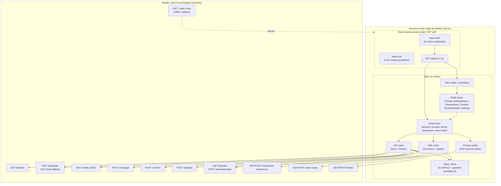

# Design Document — Web UI **backend contract**

> Retained only for the backend surface and the numbered properties that ~40 shipped
> tests reference. **The interface is not specified here** — see
> `../ui-redesign/design.md` and `../ui-redesign/PLAN.md`, which are authoritative.
> Any content below describing the region grid, the five Workspace Experience
> geometries, or the preview as a side panel is **replaced**.


## Overview

The **Web UI** is a browser client that renders screens over the `ai-app-builder` platform's existing HTTP + SSE surface. It changes no backend behavior: the Builder_Server contracts (`/healthz`, `/auth/login`, `/auth/callback`, `/events`, `/message`, `/confirm`, `/projects`, `/preview`, `/preview/restart`, `/workspace-experience`, `/work-mode`, `/theme`) are **fixed contracts** the UI consumes. This design covers how those contracts are consumed from a browser, how the assets are served without adding a runtime dependency, and how the client honors the server's Content-Security-Policy and non-disclosing security posture.

### Research findings that shape this design

The following facts were read directly out of the backend source and drive the design decisions below:

- **The server currently 405s on every unknown path** (`src/server/builder-server.js` `handle()`), including `GET /`. There is **no static-asset route today** — a browser hitting the root gets `405 method not allowed`, not HTML. Requirement 1.3 therefore requires *adding a static-serving route to the Builder_Server* (a server change) plus the assets themselves. This is the single backend touch this feature needs, and it is additive and matches the existing route-registration style. (Ref: Req 1.3.)
- **The exact CSP is stricter than the requirements summary.** `securityHeaders()` emits: `default-src 'self'; script-src 'self'; style-src 'self'; img-src 'self' data:; font-src 'self'; connect-src 'self'; object-src 'none'; base-uri 'self'; form-action 'self'; frame-ancestors 'none'`, plus `x-frame-options: DENY`, `cross-origin-resource-policy: same-origin`, `referrer-policy: no-referrer`. Two consequences: (1) `img-src` allows `data:` URIs, so a **QR code rendered as an inline `data:` image is CSP-legal** (Req 4.10) — no external QR service is needed or allowed; (2) `frame-ancestors 'none'` + `x-frame-options: DENY` mean the app document itself cannot be framed, but a **same-origin `<iframe>` inside the app pointing at a same-origin preview URL is allowed** by `default-src/frame-src 'self'` (Req 4.11). (Ref: Req 1.4, 4.10, 4.11.)
- **The zero-runtime-dependency posture is real.** `package.json` has one `dependency` (`plumby`, a local `file:` link) and one `devDependency` (`fast-check`). No bundler, transpiler, or framework is present. (Ref: Req 1.2.)
- **The exact SSE frame shapes are pure projections** (`previewStatusFrame`, `restartStatusFrame`, `workspaceExperienceFrame`, `workModeFrame`, `sessionHeaderFrame`, `themeFrame`). The client's frame handlers are written against these shapes verbatim (see Data Models).
- **The palette catalog is real backend data** (`src/model/enums.js` `THEME_CATALOG`): 8 themes, each with a frozen 9-key palette (`background, surface, accent, button, badge, statusInfo, statusSuccess, statusWarning, statusError`). Nothing renders it today; the Web UI is the first renderer. (Ref: Req 9.)
- **Preview liveness has a genuine push gap.** The server pushes `preview_status` frames on SSE, but a *dead* preview is only discoverable by polling `GET /preview`; there is no `preview_dead` push. The client therefore polls (Req 4.7–4.9).
- **Login returns a raw bearer token as JSON** (`{ token, accountId, expiresAt, tokenType: 'Bearer' }`) with `cache-control: no-store`; the CSRF `state` is cookie-bound and there is **no PKCE**. `/auth/callback` failure modes are: `200` (success), `401 { error:'access denied' }` (IdP denial / gated denial), `400 { error, code }` (client-side protocol fault). (Ref: Req 6.)

### Delivery priority (carried from requirements)

Development is staged, and the design's component boundaries make that staging cheap:

1. **Core builder screen** — prompt box + Activity_Stream + Preview_Pane.
2. **Browser login** — OIDC round-trip + Token_Store.
3. **Workspace shell** — Workspace_Experience switching, Theme rendering, Work_Mode in the header.
4. **Settings surfaces** — provider, connectors, skills, memory, project lifecycle, build/deploy, export, lock-in audit, sharing.

### Explicitly out of scope

Billing, metering, subscription plans, credit packs, email/notifications, and HTTP-edge rate limiting are a deliberate future phase and are **not** specified here. The design keeps that door open (see "Architecture — future entitlement seam") without designing any of it.

---

## Architecture

### High-level shape

The Web UI is a **single-page, no-build, vanilla ES-module client** served as static files from the same origin as the Builder_Server. It is organized into a thin transport layer, a client-side state store, a set of feature controllers, and DOM view modules. Everything is same-origin, so every `fetch` and the `EventSource`/SSE connection satisfy `connect-src 'self'`.



### Key architectural decision: no build tooling vs. a static-emitting build step

Requirement 1.2 forbids adding a runtime dependency to `ai-app-builder`, and Requirement 1.4 forbids inline scripts and external origins. There are two viable ways to satisfy this:

| Option | What it is | Pros | Cons |
| --- | --- | --- | --- |
| **A. No build tooling (vanilla ES modules)** — *recommended* | Hand-authored `index.html` + native ES-module `*.js` + `styles.css`, served verbatim. No bundler, no transpiler, nothing added to `package.json`. | Zero new deps of any kind (even dev). Nothing to build in CI. Assets are exactly what ships, trivially auditable against CSP. Matches the platform's existing zero-dep ethos. Native `<script type="module">` gives real module boundaries. | Must target evergreen browsers (fine — the platform runs on modern Android/Termux + desktop). No JSX/TS ergonomics; discipline needed to keep modules small. |
| **B. Build step that emits plain static assets** | A dev-only bundler (e.g. esbuild) that compiles TS/framework source into plain `*.js`/`*.css` with no runtime dep, output committed/served as static. | Nicer authoring ergonomics (TS, components). | Adds a `devDependency` and a build step to the *repo* even if not a *runtime* dep; a bundler runtime/polyfill can sneak a dep into the output; more surface to keep CSP-clean; contradicts the "auditable, exactly-what-ships" property. |

**Recommendation: Option A (no build tooling).** It is the strictest possible reading of Req 1.2/1.4, keeps the artifact byte-auditable against the CSP, and adds nothing — not even a devDependency — to the package. `fast-check` (already the sole devDependency) drives the property tests. The rest of this design assumes Option A. Should authoring ergonomics later justify a build step, the component boundaries below are unaffected because they are defined by responsibility, not by framework.

### Serving the assets under CSP without new runtime deps

- A small **additive static route** is added to the Builder_Server's `handle()` dispatch: `GET` for a fixed allow-list of asset paths (`/`, `/index.html`, `/app.js` and the other module files, `/styles.css`, `/manifest.webmanifest`) served with `node:fs`/`node:path` from a `src/server/public/` directory, using the existing `securityHeaders()` baseline (so the CSP is applied by the same code path as every other response). This route is placed **before** the auth-gated routes and **after** `/healthz` and `/auth/*`, so the HTML shell loads with **no Bearer_Token** (Req 1.5) and unknown paths still 405. (Ref: Req 1.1, 1.3, 1.5.)
- The shell contains **no inline `<script>` and no inline `<style>`** — all JS is `<script type="module" src="/app.js">` and all CSS is `<link rel="stylesheet" href="/styles.css">`, satisfying `script-src 'self'`/`style-src 'self'` with no `'unsafe-inline'` exception (Req 1.4). Theme colors are applied via **CSS custom properties set on `document.documentElement.style`** (the CSSOM), which is *not* an inline `<style>` element and is CSP-legal.
- Static responses are content-typed by extension and use the same non-disclosing error posture (a missing asset → generic 404, never a directory listing).

### Dependency policy (anti-lock-in, behavioral not size-based)

Dependencies are judged by the project's **behavioral anti-lock-in test**, not by size. A dependency — shipping or dev-only — is acceptable only if it is **honest** (no telemetry/phone-home, no injected branding or self-crediting, no edit-locking such as hash-locked files, no enforcement mandate to import a vendor, no exit tax on leaving or exporting), **permissively licensed** (MIT/BSD/Apache-2.0 or similar) and forkable, and it **earns its place** by removing real effort or risk.

The hardest form of lock-in is **entangled load-bearing code** — real, working vendor code threaded into a needed code path so that removing it genuinely breaks the app. This has no reliable text signal, so it is defeated **structurally, not by scanning**: any vendor/engine/shipping dependency must be consumed through **one narrow, replaceable adapter seam** that re-exports only verified surfaces and reimplements none of them, so that replacing or removing it is a contained one-file edit. The existing engine boundary is the model to follow — `ai-app-builder` consumes `plumby` **only** through `src/engine/plumby.js`, and a repo-wide grep for any other direct import must be empty.

For **this Web UI** specifically, the recommended approach (Option A above) adds **no runtime dependency and no new devDependency**: vanilla, no-build ES modules, with `fast-check` remaining the sole devDependency. Should a future shipping dependency ever be justified (for example a well-documented, permissively-licensed UI or QR helper that passes the test above), it must sit behind a **single owned adapter module** and never be imported ad hoc across the client.

This policy is codified as an always-included steering rule at `.kiro/steering/anti-lock-in.md`, and the `plumby` engine stays zero-dependency.

### Client runtime layers

1. **Transport (`api.js`, `sse.js`, `preview-poll.js`)** — the only modules that touch the network. `api.js` wraps `fetch`, attaches `Authorization: Bearer <token>` from the Token_Store to every gated call, enforces per-call timeouts, and normalizes responses into a small tagged result (`ok | denied | rateLimited | validation | protocol | timeout | error`). `sse.js` owns the `/events` connection, reconnection, and replay handling. `preview-poll.js` owns the 5s `GET /preview` liveness poll.
2. **State store (`store.js`)** — a single observable state object (session, preview, theme, workspace, work-mode, connection status, token presence). Views subscribe; controllers mutate through named actions. This centralization is what makes the SSE "replay current state on reconnect" and "poll overrides stale status" logic correct and testable in isolation.
3. **Controllers (`auth.js`, `builder.js`, `confirm.js`, `workspace.js`, `theme.js`, `work-mode.js`, `projects.js`, `settings/*.js`)** — feature logic mapping user intent + frames to store actions and API calls.
4. **Views (`views/*.js`)** — pure-ish DOM renderers that read store slices and produce/patch DOM. Diff rendering, palette application, and layout arrangement live here.

### Future entitlement seam (kept open, not designed)

Every gated request already flows through the single `api.js` client, and the server already returns `429 { error, limit, operation|resource }` for quota/rate limits (seen on `/message` and `/projects`). The UI treats `429` as a first-class, named-limit outcome **today** (Req 2.8, 7.5). That means a future billing/entitlement phase can surface plan limits, upgrade prompts, or credit balances by extending the existing `429` handling and adding new views — **without** re-plumbing transport or state. No billing concept (plan, credit, price, invoice) appears anywhere in this design; this is purely a note that the architecture does not block it.

---

## Components and Interfaces

### Transport layer

**`api.js` — gated API client**

```
request(method, path, { body?, timeoutMs?, gated=true, expect='json' }) -> ApiResult
```

- Attaches `Authorization: Bearer <token>` from the Token_Store when `gated` (Req 6.4). If `gated` and no token is held, resolves `{ kind: 'denied' }` without a network call.
- Enforces `timeoutMs` via `AbortController` (default 30s for `/message`, 5s for `/preview` and `/theme`) and maps an abort to `{ kind: 'timeout' }` (Req 2.6, 4.9, 9.7).
- Normalizes HTTP status into a tagged `ApiResult`:
  - `200/201/202` → `{ kind:'ok', status, data }`
  - `401` → `{ kind:'denied' }` (body deliberately discarded — never surfaced; Req 16.1)
  - `429` → `{ kind:'rateLimited', limit, operation?, resource? }` (Req 2.8, 7.5)
  - `400` → `{ kind:'validation'|'protocol', code?, message, data }` (Req 7.4, 6.6, 9.6)
  - other/network → `{ kind:'error' }`
- A `401` also fires a single `onAccessDenied` hook the auth controller listens to, to clear the Token_Store and return to login (Req 6.7).

**`sse.js` — Activity_Stream connection**

```
connect(projectId) ; disconnect() ; onFrame(handler) ; onStatus(handler) ; reconnectNow()
```

- Opens `GET /events?projectId=…`. Because a native `EventSource` **cannot set an `Authorization` header**, the client uses a `fetch()`-based SSE reader (`fetch` with a streaming `ReadableStream` body reader, `Accept: text/event-stream`, Bearer header attached) rather than `EventSource`. This is the mechanism that lets Req 3.1's "authorized with the Bearer_Token" and Req 6.4 be met on the stream. It parses the `data:` lines and `retry:` hint the server sends.
- Reconnect policy: on drop, retry with a fixed/backoff interval **capped at ≤5s**, up to **10 consecutive attempts** (Req 3.5); after 10 failures, emit `status:'lost'` so the view shows a connection-lost message + manual reconnect control (Req 3.6). `reconnectNow()` resets the counter (manual reconnect).
- A `401` on the stream open emits `status:'unauthorized'` and does **not** open the Activity_Stream view (Req 3.2).
- Frame hygiene: drops any frame `> 1,048,576` bytes or of an unrecognized `type`, without rendering and **without closing** the connection (Req 3.9).
- On (re)connect the server replays current-state frames (`turn_state`, `preview_status`, `workspace_experience`, `theme`, `work_mode`, `session_header`, pending `confirm_request`); `sse.js` passes them through the same `onFrame` path so replay and live handling share one code path (Req 3.7, 5.4).

**`preview-poll.js` — preview liveness poll**

```
start(projectId) ; stop()
```

- While a Project_Session is open, calls `GET /preview?projectId=…` every **5s** (Req 4.7).
- A poll that returns a non-live preview updates the store's preview status to a failure indication (Req 4.8); a poll that times out (5s) or returns non-success **retains** the last known status and continues on the next interval (Req 4.9).
- The poll is the *only* mechanism for detecting a dead preview (the known SSE gap); SSE `preview_status` frames remain the source for `loading/ready/showing_prior/error/persistent_failure` transitions.

### State store

**`store.js`**

```
getState() ; subscribe(selector, cb) ; dispatch(action)
```

Holds the client-side models in Data Models below. Notable invariants enforced here:
- `submitInFlight` gates a second `/message` submit for the same session (Req 2.5).
- `committedTheme` is only overwritten by a committed `theme` frame or a committed `GET /theme` read; a `previewed:true` frame writes `previewedTheme` only and never touches `committedTheme` (Req 9.3–9.5).

### Controllers

- **`auth.js`** — login navigation, `/auth/callback` handling, Token_Store lifecycle, logout, expiry timer (Req 6).
- **`builder.js`** — prompt validation + submit, running-turn indicator, timeout/retry (Req 2), Activity_Stream frame handling (Req 3).
- **`confirm.js`** — render/answer `confirm_request`, keep visible until answered, re-display on replay (Req 5).
- **`preview.js`** — apply `preview_status` frames, mobile QR/URL, restart control, consume poll results (Req 4).
- **`workspace.js`** — Workspace_Experience select + `workspace_experience` frame → layout arrangement (Req 8, 11).
- **`theme.js`** — theme catalog control, preview/commit/cancel, apply palette as CSS custom properties (Req 9).
- **`work-mode.js`** — header Work_Mode display + switch (Req 10).
- **`projects.js`** — project-creation form (category + origin), open session on 201 (Req 7).
- **`settings/*.js`** — provider, connectors, skills, memory, build/deploy/export/audit/share (Req 12–15). These consume backend endpoints whose exact shapes are not fixed in the requirements glossary; the controllers use the same `api.js` tagged-result contract and the same non-disclosing error handling, and are the last delivery stage.

### Views

- **`views/prompt.js`** — textarea (1–10,000 chars) + submit; disabled state during in-flight turn; touch-sized controls (Req 2, 11.3).
- **`views/activity-stream.js`** — ordered append by monotonic sequence id; diff rendering with a persistent non-color `+`/`-` prefix marker in addition to color (Req 3.3, 3.4).
- **`views/preview-pane.js`** — same-origin `<iframe>` for the preview URL; loading/showing_prior/error/persistent_failure indicators; QR (`data:` image) + selectable URL for mobile targets (Req 4).
- **`views/confirm.js`** — approve/deny controls, touch-sized (Req 5, 11.3).
- **`views/session-header.js`** — active Work_Mode + switch control, current experience + theme; always visible at 360px (Req 10, 11.4).
- **`views/layout.js` **(DELETED — superseded, see ../ui-redesign/PLAN.md)**** — arranges surfaces per the `workspace_experience` layout descriptor; single-column touch layout for `mobile-command-center`; renders `attribution` when present (Req 8, 11).
- **`views/settings/*`** — the remaining surfaces.

---

## Data Models

All client-side state is plain JSON-serializable objects held in `store.js`. None of it is server-authoritative — it mirrors what the fixed backend contracts report.

### Token_Store

The Bearer_Token holder. **Written as a single atomic object** so `token`, `accountId`, and `expiresAt` are never partially present (Req 6.2).

```js
// TokenRecord (or null when logged out)
{ token: string, accountId: string, expiresAt: string /* ISO-8601 */ }
```

Persistence decision (Req 16.3, "not readable by another origin"):
- **Primary: in-memory only** (a module-scoped variable). Same-origin JS can read it; no other origin can. This is the strictest interpretation and is the default.
- **Optional session continuity: `sessionStorage`** (origin-scoped by the browser's same-origin policy, cleared when the tab closes). `sessionStorage` is *not* readable by another origin, so it satisfies Req 16.3 while surviving reloads.
- **Rejected: cookies and `localStorage` shared across subdomains** — the token is never written anywhere a sibling origin/subdomain could read.
- Lifecycle: cleared atomically on expiry-reached, on any gated `401`, and on logout, each returning the user to the login control within 1s (Req 6.7, 6.9).

### Client Session state

```js
Session {
  projectId: string | null,
  connection: 'connecting' | 'open' | 'reconnecting' | 'lost' | 'unauthorized',
  reconnectAttempts: number,          // 0..10
  submitInFlight: boolean,            // gates a 2nd /message (Req 2.5)
  pendingPromptText: string,          // retained on timeout/429 (Req 2.6, 2.8)
  lastSeq: number | null,             // highest rendered monotonic sequence id (Req 3.3)
  activity: ActivityItem[],           // ordered reasoning/tool/diff frames
  pendingConfirms: Map<requestId, ConfirmPayload>  // (Req 5.3, 5.4)
}
```

`ActivityItem` is a normalized view of an Activity_Stream frame: `{ seq, kind:'reasoning'|'tool'|'diff', ... }`. Diff items carry `hunks` where each line has `{ marker:'+'|'-'|' ', text }` so the `+`/`-` prefix is data, not just CSS color (Req 3.4).

### Preview state

Mirrors `previewStatusFrame`/`restartStatusFrame` shapes (`src/server/builder-server.js`):

```js
Preview {
  status: 'loading' | 'ready' | 'showing_prior' | 'error' | 'persistent_failure',
  url: string | null,
  snapshotId: string | null,
  showingPrior: boolean,
  cause: string | null,               // safe single-line summary only (Req 3.8, 4.4, 4.5)
  restartOffered: boolean,            // (Req 4.6)
  mobile: { url: string } | null,     // mobile connection details → QR + text (Req 4.10)
  source: 'sse' | 'poll'              // for reconciling the poll gap (Req 4.7–4.9)
}
```

- A `ready` frame with empty `url` → **retain prior state**, show "ready URL unavailable" error (Req 4.2).
- A `loading` status suppresses previously rendered preview content (Req 4.3).

### Theme state

Mirrors `themeFrame` and `THEME_CATALOG`:

```js
ThemeState {
  catalog: { [themeId]: { id, displayName, base, palette } }, // 8 entries
  committedTheme: string,             // last committed theme id (Req 9.4)
  committedPalette: Palette,          // applied baseline (Req 9.5 revert target)
  previewedTheme: string | null,      // uncommitted preview (Req 9.3)
  workspaceExperience: string         // theme is committed per (account, experience)
}
Palette {
  background, surface, accent, button, badge,
  statusInfo, statusSuccess, statusWarning, statusError  // all hex strings
}
```

The active palette is applied by setting nine CSS custom properties on `document.documentElement` (`--color-background`, `--color-surface`, …). `styles.css` references only `var(--color-*)`, so applying a palette recolors every styled surface (Req 9.1). Reverting simply re-applies `committedPalette` (Req 9.5).

### Workspace state

Mirrors `workspaceExperienceFrame` + the layout descriptors in `src/presentation/layouts.js`:

```js
Workspace {
  experience: 'kiro-style'|'vibe-first'|'technical-workbench'|'mobile-command-center'|'custom',
  layout: LayoutDescriptor,           // { id, name, regions[], surfaces{ activityStream, preview, compose, filePanel, sessionHeader } }
  attribution: string | null          // rendered when present (Req 8.4)
}
```

`layout.surfaces` entries (`{ region, visible, order, size, collapsible?, collapsed? }`) drive `views/layout.js` **(DELETED — superseded, see ../ui-redesign/PLAN.md)**. Selecting an experience changes **layout only** — the client never mutates theme/work-mode/project data on a `workspace_experience` frame (Req 8.3).

### Work_Mode state

Mirrors `workModeFrame`/`sessionHeaderFrame`:

```js
WorkMode {
  active: 'vibe' | 'spec' | 'hybrid',   // defaults to 'vibe' for a new session (Req 10.5)
  choices: string[]                     // offered choices from the frame (Req 10.2)
}
```

### SSE frame handling (recognized frame-type registry)

The client keeps a closed set of recognized frame `type`s and a handler per type. Any frame with a `type` outside this set (or over the 1 MiB cap) is discarded without rendering and the connection stays open (Req 3.9).

| Frame `type` | Handler | Requirement |
| --- | --- | --- |
| reasoning / tool activity (Activity_Stream frames) | append ordered by seq | 3.3 |
| diff | render with `+`/`-` markers | 3.4 |
| `preview_status` | update Preview state | 4.1–4.6 |
| `preview_mobile` (typed mobile frame) | set `Preview.mobile` → QR + URL | 4.10 |
| `confirm_request` | show confirm; store pending | 5.1, 5.4 |
| `error` | show generic message + correlationId only | 3.8, 16.2 |
| `work_mode` | update active mode + choices | 10.2 |
| `session_header` | update header mode + choices | 10.1, 10.2 |
| `workspace_experience` | rearrange layout only | 8.3, 8.4 |
| `theme` | apply palette (preview vs committed) | 9.1, 9.3, 9.4 |
| `turn_state` / `turn_start` / `turn_done` | drive running-turn indicator | 2.5, 3.7 |
| `confirm_timeout` | clear the pending confirm | 5.3 |

The `error` frame handler renders only `message` + `correlationId` and never any raw cause/stack/diagnostic (Req 3.8, 16.2).


---

## Correctness Properties

*A property is a characteristic or behavior that should hold true across all valid executions of a system — essentially, a formal statement about what the system should do. Such properties serve as the bridge between human-readable specifications and machine-verifiable correctness guarantees.*

This kind of property-based testing **applies well here**: most of the Web UI's risk lives in pure logic that is a function of its inputs — prompt validation, SSE frame parsing/ordering/dispatch, reconnect scheduling, palette application, token-record validation, and the theme preview/commit/revert state machine. Each is testable as a `for all inputs` statement with `fast-check` (the platform's existing devDependency). Visual/layout criteria, one-time bootstrap paths, cadence timing, and settings surfaces whose backend shapes are not fixed here are covered by example, edge-case, integration, or smoke tests in the Testing Strategy instead.

The prework analysis was reflected to remove redundancy: the three prompt-validation partitions collapse into one property; the two `429` surfaces into one parametrized property; the callback success/failure branches into one payload-validation property; the token-clear triggers into one clearing property; the two failure preview statuses into one cause-iff-present property; the two theme-failure branches into one keep-committed property; and the `error`-frame SSE (3.8) and non-disclosing error handling (16.2) into one non-disclosure property.

### Property 1: Prompt validation gates submission by trimmed length

*For any* prompt string, the client submits `POST /message` (with the trimmed text) **iff** the string's length after trimming leading/trailing whitespace is in the inclusive range 1..10,000; a string that trims to length 0 (including all-whitespace strings) or to length > 10,000 is rejected with no `/message` call and the entered text retained.

**Validates: Requirements 2.2, 2.3, 2.4**

### Property 2: A submitted prompt carries the trimmed text

*For any* prompt string that passes validation, the body sent to `POST /message` contains exactly the input trimmed of leading and trailing whitespace (not the raw input).

**Validates: Requirements 2.2**

### Property 3: An in-flight turn admits no second concurrent submit

*For any* number of submit attempts made while a Project_Session's turn is in flight, the client issues zero additional `POST /message` calls for that session and keeps the submit control disabled until the turn ends.

**Validates: Requirements 2.5**

### Property 4: A rate-limited surface displays the named limit and retains input

*For any* `HTTP 429` response naming an exceeded limit, on either the prompt surface or the project-creation surface, the client displays the named limit and keeps the submitted text (prompt text, or the still-editable form) available for retry.

**Validates: Requirements 2.8, 7.5**

### Property 5: Activity_Stream frames render in ascending sequence order

*For any* set of Activity_Stream frames delivered in any arrival order, the rendered Activity_Stream list is ordered strictly ascending by each frame's monotonic sequence identifier, and contains each delivered frame exactly once.

**Validates: Requirements 3.3**

### Property 6: Diffs carry a persistent non-color marker per line

*For any* file-diff frame, every rendered added line begins with a `+` textual marker and every removed line with a `-` textual marker, independent of any color styling.

**Validates: Requirements 3.4**

### Property 7: SSE reconnection is bounded in interval and count

*For any* sequence of connection drops, every automatic reconnection attempt is scheduled with a delay not exceeding 5,000 ms, and the client makes at most 10 consecutive automatic attempts before ceasing and reporting the stream lost.

**Validates: Requirements 3.5, 3.6**

### Property 8: Unrecognized or oversized frames are dropped without closing the stream

*For any* received frame, if its serialized size exceeds 1,048,576 bytes or its `type` is not in the recognized frame-type set, the client renders nothing and mutates no state for that frame while leaving the SSE connection open; every recognized, in-size frame is dispatched to its handler.

**Validates: Requirements 3.9**

### Property 9: The error-frame / access-denied renderer discloses nothing beyond the safe fields

*For any* `error` SSE frame carrying arbitrary additional fields (raw cause, stack, secret, internal ids), the client renders only the frame's generic `message` and `correlationId` and no other field value appears in the rendered output.

**Validates: Requirements 3.8, 16.2**

### Property 10: A ready preview frame is applied only with a usable URL

*For any* `preview_status` frame with status `ready`: if its `url` is a non-empty string the preview state becomes `{ status: 'ready', url }` with any prior loading indicator/content replaced; if its `url` is missing or empty the prior preview state is retained and a URL-unavailable error indication is shown.

**Validates: Requirements 4.1, 4.2**

### Property 11: A loading status suppresses previously rendered preview content

*For any* prior preview state, applying a `preview_status` frame with status `loading` yields a loading indicator and suppresses any previously rendered preview content.

**Validates: Requirements 4.3**

### Property 12: Failure-state frames show a cause summary iff one is present

*For any* `preview_status` frame with status `showing_prior`, `error`, or `persistent_failure`, the client shows the corresponding indicator and displays the frame's safe `cause` summary text **iff** that summary is a non-empty string.

**Validates: Requirements 4.4, 4.5**

### Property 13: The restart control appears exactly when offered and calls restart

*For any* `preview_status` frame, a restart control is present **iff** the frame reports `restartOffered` true, and activating a present control issues `POST /preview/restart` for the session.

**Validates: Requirements 4.6**

### Property 14: A non-live poll result drives a failure state; a failed poll is inert

*For any* `GET /preview` poll result: a result reporting a non-live preview transitions the preview state to a failure indication (tagged `source: 'poll'`); a poll that times out or returns a non-success result leaves the last known preview state unchanged and schedules the next poll.

**Validates: Requirements 4.8, 4.9**

### Property 15: The mobile connection URL round-trips through its QR encoding

*For any* non-empty mobile connection URL, the Preview_Pane displays that URL as selectable text and renders a QR code whose decoded content equals the URL exactly (encode-then-decode is the identity on the URL).

**Validates: Requirements 4.10**

### Property 16: A confirm decision posts the frame's request id

*For any* `confirm_request` frame and either decision, the client renders both approve and deny controls and, on the user's choice, issues `POST /confirm` carrying that frame's `requestId` and the chosen `approved` boolean.

**Validates: Requirements 5.1, 5.2**

### Property 17: A pending confirm stays visible and is re-displayed idempotently

*For any* sequence of intervening non-answer frames (including a reconnect that replays the same still-pending `confirm_request`), an unanswered confirm remains displayed exactly once, keyed by its `requestId`, until it is answered or a matching `confirm_timeout` clears it.

**Validates: Requirements 5.3, 5.4**

### Property 18: A valid callback payload is stored atomically; an invalid one is discarded

*For any* `/auth/callback` `HTTP 200` payload: if `token` and `accountId` are non-empty and `expiresAt` is a valid future ISO-8601 timestamp, the Token_Store ends holding exactly `{ token, accountId, expiresAt }` (never a partially written record); otherwise nothing is written to the Token_Store and the user is returned to the login control.

**Validates: Requirements 6.2, 6.3**

### Property 19: Every gated request while a token is held carries the Bearer header

*For any* gated operation the client issues while a Token_Store record is present — `POST /message`, `POST /confirm`, `POST /projects`, `GET /preview`, `POST /preview/restart`, `GET`/`POST /theme`, `GET`/`POST /work-mode`, `GET`/`POST /workspace-experience`, and the `GET /events` SSE connect — the outgoing request carries `Authorization: Bearer <token>` with the stored token.

**Validates: Requirements 6.4, 3.1**

### Property 20: A login-protocol code is never disclosed, and a restart is offered

*For any* `/auth/callback` `HTTP 400` payload carrying a login-protocol `code`, the message the client displays does not contain the raw `code` value as a substring, and a control that restarts the Login_Flow is present.

**Validates: Requirements 6.6**

### Property 21: Every token-clearing trigger fully empties the Token_Store

*For any* clearing trigger — the stored `expiresAt` being reached, any gated request returning an Access_Denied_Response, or the user activating logout — the Token_Store ends with no field remaining (`token`, `accountId`, and `expiresAt` all removed) and the user is returned to the login control.

**Validates: Requirements 6.7, 6.9**

### Property 22: No Login_Flow request carries a PKCE code verifier

*For any* request the client issues as part of the Login_Flow, the request carries no PKCE `code_verifier` (or equivalent PKCE) parameter, relying solely on the backend's cookie-bound `state`.

**Validates: Requirements 6.8**

### Property 23: A created project opens its session, and a validation error stays editable

*For any* `POST /projects` outcome: an `HTTP 201` carrying a project id opens the core builder screen for a Project_Session whose `projectId` equals that id; an `HTTP 400` validation error displays the response's specific message and leaves the form editable.

**Validates: Requirements 7.2, 7.3, 7.4**

### Property 24: Applying a Workspace_Experience frame changes layout only

*For any* `workspace_experience` frame, applying it updates only the Workspace layout/experience slice and any carried `attribution` credit (shown iff non-empty), while the Theme, Work_Mode, Preview, and Session activity slices are unchanged.

**Validates: Requirements 8.3, 8.4**

### Property 25: Selecting a Workspace_Experience or Work_Mode posts the selected value

*For any* selected Workspace_Experience among the five, the client issues `POST /workspace-experience` with that value; and *for any* selected Work_Mode among `vibe`/`spec`/`hybrid`, the client issues `POST /work-mode` with that mode.

**Validates: Requirements 8.2, 10.4**

### Property 26: Applying a theme frame sets the full palette on the surface

*For any* `theme` frame, applying it sets all nine CSS custom properties (`--color-background`, `--color-surface`, `--color-accent`, `--color-button`, `--color-badge`, `--color-statusInfo`, `--color-statusSuccess`, `--color-statusWarning`, `--color-statusError`) on the document root to the frame palette's corresponding values, so every `var(--color-*)`-styled element resolves to the new value.

**Validates: Requirements 9.1**

### Property 27: Theme preview is non-committing and cancel is a round-trip to committed

*For any* committed theme C and any previewed theme T: previewing T applies T's palette to the surface while leaving the last-committed theme and palette equal to C; committing T applies T's palette and records T as the last committed theme; and cancelling/navigating away from a preview without committing restores the surface exactly to C's palette (preview-then-cancel is the identity on the committed palette).

**Validates: Requirements 9.3, 9.4, 9.5**

### Property 28: A failed theme change keeps the last committed palette applied

*For any* `POST /theme` failure — an `HTTP 400 { code: 'unsupported_theme' }`, a timeout, or any other non-200 status — the surface keeps the last committed theme's palette applied and the client shows the corresponding message (unsupported vs. could-not-complete).

**Validates: Requirements 9.6, 9.7**

### Property 29: A Work_Mode / session_header frame sets the displayed mode and choices

*For any* `work_mode` or `session_header` frame, the Session_Header's displayed active mode and offered choices equal the frame's `mode`/`workMode` and `choices`/`workModeChoices`.

**Validates: Requirements 10.2**

### Property 30: A submitted connector secret is never rendered back in plaintext

*For any* secret value entered for a Connector, after submission no rendered DOM text contains the stored secret value in plaintext.

**Validates: Requirements 13.3**

### Property 31: An Access_Denied_Response yields one generic indication and discloses nothing

*For any* gated surface in the client and *for any* `HTTP 401` response body (including adversarial bodies embedding project ids, paths, or existence hints), the client renders a single generic access-denied indication, surfaces re-authentication, and no field value from the 401 body appears in the rendered output, and the client makes no resource-existence inference visible to the user.

**Validates: Requirements 16.1, 2.7, 5.5, 15.6**


---

## Error Handling

The Web UI's error handling is built to honor the backend's **non-disclosing** posture: the server returns a single generic `401 { error: 'access denied' }` for every authn/authz failure and generic `error` SSE frames for turn failures, and the client must never widen that disclosure.

### Central classification (in `api.js`)

Every network response is normalized once into a tagged `ApiResult`, so error policy lives in one place and cannot drift per surface:

| Outcome | `ApiResult` | Client behavior |
| --- | --- | --- |
| `401` (any body) | `denied` | Discard the body entirely. Surface one generic access-denied indication + re-authentication. Fire the token-clear/return-to-login flow. Never render any body field or infer resource existence. (Req 16.1, 2.7, 5.5, 15.6, 6.7) |
| `429` (limit named) | `rateLimited` | Display the named limit; retain the user's input for retry. (Req 2.8, 7.5) |
| `400` on `/projects` | `validation` | Display the backend's **specific** message (this surface is explicitly allowed to show validation detail); keep the form editable. (Req 7.4) |
| `400` on `/auth/callback` with `code` | `protocol` | Display a generic login-failed message that **excludes** the raw `code`; offer a Login_Flow restart. (Req 6.6) |
| `400 { code:'unsupported_theme' }` on `/theme` | `validation` | Keep the last committed palette; show "theme unsupported". (Req 9.6) |
| Timeout (`AbortController`) | `timeout` | Per-surface: `/message` → end in-flight, re-enable submit, retain text, show timeout (Req 2.6); `/theme` → keep committed palette, show could-not-complete (Req 9.7); `/preview` poll → retain last status, keep polling (Req 4.9). |
| Other non-2xx / network | `error` | Generic non-disclosing error indication; no raw detail. |

**Distinction preserved:** a `401` is *always* non-disclosing (body discarded), whereas a `400` validation body on `/projects` is a backend-authored *specific* message the UI is required to show. These are different code paths precisely because the requirements treat them differently (Req 16.1 vs. Req 7.4).

### SSE error frames

The `error` frame handler (Data Models → frame registry) renders only `message` + `correlationId`; any other field on the frame (raw cause, stack, secret) is never read into the DOM (Req 3.8, 16.2, Property 9). Oversized/unknown frames are dropped without disturbing the stream (Req 3.9, Property 8).

### Connection and liveness failures

- SSE drop → bounded reconnect (≤5s × ≤10), then connection-lost + manual reconnect (Req 3.5, 3.6, Property 7). A `401` on stream open → unauthorized status, activity view not shown (Req 3.2).
- Preview: the poll is the safety net for the known "dead preview not pushed over SSE" gap; a failed poll is inert (retain + continue), a non-live poll drives the failure state (Req 4.8, 4.9, Property 14).

### Token lifecycle failures

Expiry-reached, any gated `401`, and logout all clear the Token_Store atomically and return to login within 1s (Req 6.7, 6.9, Property 21). Storage is same-origin-scoped only (in-memory / `sessionStorage`), never a cross-origin-readable sink (Req 16.3).

---

## Testing Strategy

The Web UI is tested with a **dual approach**: `fast-check` property tests for the universal logic captured in Correctness Properties, plus example, edge-case, integration, and smoke tests for the criteria that are not universal (bootstrap paths, cadence timing, visual/layout, and settings surfaces whose backend shapes are not fixed here).

### Test runtime and tools

- **Runner:** the platform's existing `node --test` (`package.json` `test` script). No new runner.
- **Property library:** **`fast-check`** — already the sole `devDependency`; **not** reimplemented. No new dependency is added for testing.
- **DOM:** the pure logic under test (validation, frame reducers, reconnect scheduler, palette map, token-record validation, theme state machine) is factored to be **DOM-free** so it runs under `node --test` without a browser. The thin DOM view layer is tested with a lightweight same-origin harness (a minimal DOM shim or `jsdom`-style document *if* one is already available in the toolchain; otherwise view assertions are expressed against the produced virtual node/description the view module emits, keeping tests dependency-free). Preview/CSP/iframe/QR-scan and 360px-layout checks that genuinely need a browser are integration/visual tests run against the served assets.

### Property-based testing configuration (required)

- Each Correctness Property (1–31) is implemented by a **single** `fast-check` property test.
- Each property test runs a **minimum of 100 iterations** (`fc.assert(fc.property(...), { numRuns: 100 })` or higher).
- Each property test is tagged with a comment referencing its design property, in the format:
  - **`Feature: web-ui, Property {number}: {property_text}`**
- Generators are built from the fixed contracts so inputs are realistic and adversarial:
  - prompt strings incl. Unicode whitespace, boundary lengths (0, 1, 10000, 10001);
  - Activity frames with arbitrary/duplicate/shuffled sequence ids;
  - `preview_status` frames across all five statuses with/without `url`/`cause`/`restartOffered`;
  - `error` frames seeded with adversarial extra fields (fake `cause`, `stack`, `secret`, project ids);
  - `401` bodies embedding project ids/paths (to attack Property 31);
  - the 8 catalog palettes plus generated 9-key palettes;
  - callback payloads with missing fields and past/invalid `expiresAt`;
  - the closed enums (Target_Category, Project_Origin, Workspace_Experience, Work_Mode, Theme) for the selection/dispatch properties;
  - mobile URLs for the QR round-trip (Property 15).

### Example / edge-case unit tests

Covering the non-universal criteria (kept few, since properties cover input breadth):
- Bootstrap paths: default Workspace_Experience via `GET /workspace-experience` (8.5), default Theme via `GET /theme` (9.8), new-session `vibe` default (10.5), root-shell-without-token (1.5).
- Cadence/timing with a fake clock: `/message` 30s timeout (2.6), `/preview` 5s poll cadence (4.7), SSE open within 2s (3.1), login navigation within 500ms (6.1).
- Terminal states: connection-lost after the 10th failure (3.6), reconnect-replay applies each slice (3.7).
- Origin-specific form gates: template (7.6), github-import (7.7), fork (7.8).
- Presence of closed option sets: categories/origins (7.1), experiences (8.1), themes (9.2), modes (10.3).
- Settings surfaces (12–15): render + submit-with-Bearer + outcome/error display, and export-download side-effect. These are last-stage and use the same `api.js` tagged-result contract and non-disclosing 401 handling.
- Token storage sink (16.3): assert the Token_Store writes only to in-memory / `sessionStorage` and never to `document.cookie` or a cross-origin-readable location.

### Integration tests (against the served assets)

These verify the assets and the additive static route, not universal logic:
- `GET /` returns `200 text/html` loading the client (not JSON), unauthenticated, carrying the `securityHeaders()` CSP (Req 1.1, 1.3, 1.5).
- The shell loads and executes with **no** inline-script/style and **no** external-origin fetch under the exact CSP — verified both by static analysis of the asset files (Property-style structural check over the asset set, Req 1.4) and by loading the page in a CSP-enforcing context and asserting no CSP violation is reported.
- The preview `<iframe>` is same-origin and the app document is not embeddable cross-origin (`frame-ancestors 'none'` / `X-Frame-Options: DENY`) (Req 4.11).
- Mobile: QR image is an `img-src 'self' data:`-legal `data:` image and the 360px layout has no horizontal overflow of the primary column (Req 4.10, 11.1–11.4). The QR *content* correctness is the property test (Property 15); this integration test covers the *rendering/CSP* side.

### Smoke tests

- `package.json` `dependencies` did not grow — the Web UI added **no** runtime dependency (Req 1.2). A single assertion in CI.

### Backend touch under test

The one additive backend change (the static-serving route in `builder-server.js`) is covered by the integration tests above and follows the server's existing route-registration and `securityHeaders()` pattern, so it inherits the CSP by construction and adds no dependency.

---

## Requirements Traceability Summary

- **Req 1 (serve as static assets under CSP):** Architecture → serving section; additive static route; no-inline-script/style; Property (structural) + integration + smoke tests.
- **Req 2 (prompt submission):** `builder.js`/`views/prompt.js`; Properties 1–4; timeout example (2.6).
- **Req 3 (Activity_Stream SSE):** `sse.js`/`views/activity-stream.js`; Properties 5–9; open/replay examples (3.1, 3.7).
- **Req 4 (preview pane):** `preview.js`/`preview-poll.js`/`views/preview-pane.js`; Properties 10–15; cadence/iframe examples (4.7, 4.11).
- **Req 5 (confirm approvals):** `confirm.js`/`views/confirm.js`; Properties 16, 17; 401 example (5.5).
- **Req 6 (browser OIDC login):** `auth.js` + Token_Store; Properties 18–22; login-control example (6.1).
- **Req 7 (project creation):** `projects.js`; Properties 4, 23; origin-form examples (7.6–7.8).
- **Req 8 (workspace switching):** `workspace.js`/`views/layout.js` **(DELETED — superseded, see ../ui-redesign/PLAN.md)**; Properties 24, 25; default example (8.5).
- **Req 9 (theme render + preview/commit):** `theme.js`; Properties 26–28; default example (9.8).
- **Req 10 (work mode):** `work-mode.js`/`views/session-header.js`; Properties 25, 29; default example (10.5).
- **Req 11 (mobile):** `views/layout.js` **(DELETED — superseded, see ../ui-redesign/PLAN.md)**; examples/integration (11.1–11.4).
- **Req 12–15 (settings surfaces):** `settings/*`; Property 30 (secret non-disclosure); examples otherwise; last delivery stage.
- **Req 16 (non-disclosing errors):** `api.js` central classification; Properties 9, 31; storage-sink example (16.3).

## Next steps

The design covers Overview, Architecture (with diagram), Components and Interfaces, Data Models, Correctness Properties, Error Handling, and Testing Strategy, and maps decisions back to the requirements. Review it and, if it looks right, you can move on to generating the task list. If you spot gaps, I can return to the requirements to clarify (for example, the exact backend shapes for the provider/connectors/skills/memory/build/deploy/export/audit/share endpoints, which are treated as fixed-but-unspecified here).
